# Configuring Audio Input and Output(Realtek® ALC1220 CODEC)

| Realtek® ALC1 | 1220 CODEC                            | 2  |
|---------------|---------------------------------------|----|
|               | Configuring 2/4/5.1/7.1-Channel Audio |    |
|               | Configuring S/PDIF Out                |    |
| 1-3           | Stereo Mix                            | 7  |
| 1-4           | Using the Voice Recorder              | 9  |
| 1-5           | DTS:X® Ultra                          | 10 |
|               |                                       |    |
| ESS ES9280A   | AC DAC chip + ESS ES9080 chip         | 12 |

#### **Realtek® ALC1220 CODEC**

After you install the includedmotherboard drivers,make sure your Internet connection works properly. the system will automatically install the audio driver fromMicrosoft Store. Restart the systemafter the audio driver is installed.

# **1-1 Configuring 2/4/5.1/7.1-Channel Audio**

The picture to the right shows the default six audio jacks assignment.

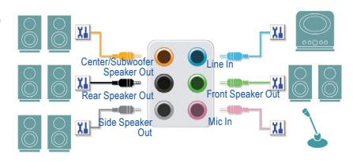

### Audio Jack Configurations:

| Jack                         | Headphone/ 2-channel | 4-channel | 5.1-channel | 7.1-channel |
|------------------------------|-------------------------|-----------|-------------|-------------|
| Center/Subwoofer Speaker Out |                         |           | a           | a           |
| Rear Speaker Out             |                         | a         | a           | a           |
| Side Speaker Out             |                         |           |             | a           |
| Line In                      |                         |           |             |             |
| Line Out/Front Speaker Out   | a                       | a         | a           | a           |
| Mic In                       |                         |           |             |             |

The picture to the right shows the default five audio jacks assignment.

To configure 4/5.1/7.1-channel audio, you have to retask either the Line in or Mic in jack to be Side speaker out through the audio driver.

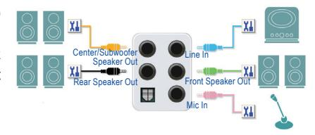

#### Audio Jack Configurations:

| Jack                         | Headphone/ 2-channel | 4-channel | 5.1-channel | 7.1-channel |
|------------------------------|-------------------------|-----------|-------------|-------------|
| Center/Subwoofer Speaker Out |                         |           | a           | a           |
| Rear Speaker Out             |                         | a         | a           | a           |
| Line In/Side Speaker Out     |                         |           |             | a           |
| Line Out/Front Speaker Out   | a                       | a         | a           | a           |
| Mic In/Side Speaker Out      |                         |           |             | a           |

You can change the functionality of an audio jack using the audio software.

The picture to the right shows the default three audio jacks assignment.

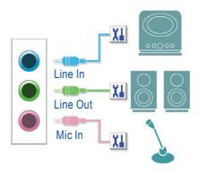

### Audio Jack Configurations:

| Jack                                  | Headphone/ 2-channel | 4-channel | 5.1-channel | 7.1-channel |
|---------------------------------------|-------------------------|-----------|-------------|-------------|
| Line In/Rear Speaker Out              |                         | a         | a           | a           |
| Line Out/Front Speaker Out            | a                       | a         | a           | a           |
| Mic In/Center/Subwoofer Speaker Out   |                         |           | a           | a           |
| Front Panel Line Out/Side Speaker Out |                         |           |             | a           |

The picture to the right shows the default two audio jacks assignment. Line Out

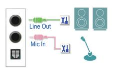

### • Realtek® ALC1220 CODEC

### Audio Jack Configurations:

| Jack                                              | Headphone/ 2-channel | 4-channel | 5.1-channel | 7.1-channel |
|---------------------------------------------------|-------------------------|-----------|-------------|-------------|
| Line Out/Front Speaker Out                        | a                       | a         | a           | a           |
| Mic In/Rear Speaker Out                           |                         | a         | a           | a           |
| Front Panel Line Out/Side Speaker Out             |                         |           |             | a           |
| Front PanelMic In/Center/Subwoofer Speaker Out |                         |           | a           | a           |

#### • Realtek® ALC1220 CODEC + ESS ES9118 DAC chip

#### Audio Jack Configurations:

| Jack                                               | Headphone/ 2-channel | 4-channel | 5.1-channel |
|----------------------------------------------------|-------------------------|-----------|-------------|
| Line Out/Front Speaker Out                         | a                       | a         | a           |
| Mic In/Rear Speaker Out                            |                         | a         | a           |
| Front Panel Line Out                               |                         |           |             |
| Front Panel Mic In/Center/Subwoofer Speaker Out |                         |           | a           |

You can change the functionality of an audio jack using the audio software.

# **A. Configuring Speakers**

### Step 1:

Go to the Start menu click the **Realtek Audio Console**. For speaker connection, refer to the instructions in Chapter 1, "Hardware Installation," "Back Panel Connectors."

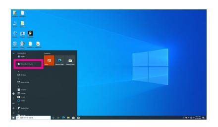

### Step 2:

Connect an audio device to an audio jack. The **Which device did you plut in ?** dialog box appears. Select the device according to the type of device you connect. Then click **OK**.

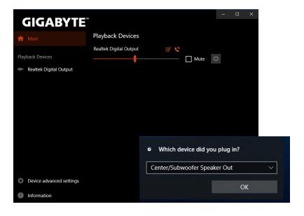

### Step 3 (Note):

Click the **Device advanced setting** on the left. Select the **Mute the internal output device, when an external headphone plugged in** check box to enable 7.1-channel audio.

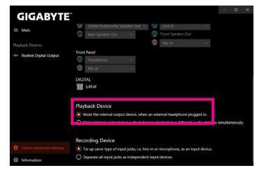

### Step 4:

On the**Speakers** screen, click the**Speaker Configuration** tab. In the **Speaker Configuration** list, select **Stereo**, **Quadraphonic**, **5.1 Speaker**, or **7.1 Speaker** according to the type of speaker configuration you wish to set up. Then the speaker setup is completed.

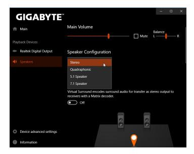

(Note) If your motherboard has only one Realtek® ALC1220 codec and two audio jacks on the rear panel, you can follow this step to enable 7.1-channel audio.

# **B. Configuring Sound Effect**

You may configure an audio environment on the **Speakers** tab.

# **C. Enabling Smart Headphone Amp**

The Smart Headphone Amp feature automatically detects impedance of your head-worn audio device, whether earbuds or high-end headphones to provide optimal audio dynamics. To enable this feature, connect your head-worn audio device to the Line out jack on the rear panel and then go to the **Speaker** page. Enable the **Smart Headphone Amp** feature. The **Headphone Power** list below allows you to manually set the level of headphone volume, preventing the volume from being too high or too low.

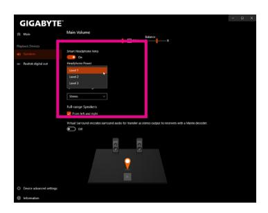

# **\* Configuring the Headphone**

When you connect your headphone to the Line out jack on the back panel or front panel, make sure the default playback device is configured correctly.

Step 1: Locate the icon in the notification area and right-click on the icon. Select **Open Sound settings**.

Step 2: Select **Sound Control Panel.**

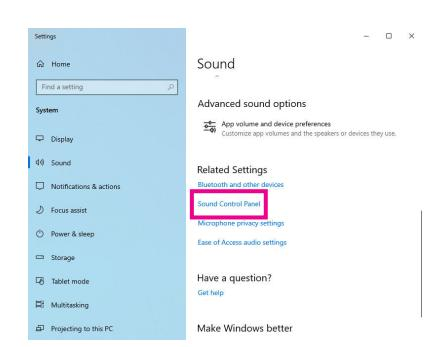

Step 3:

On the **Playback** tab, make sure your headphone is set as the default playback device. For the device connected to the Line out jack on the back panel, right-click on **Speakers** and select **Set as Default Device**; for the device connected to the Line out jack on the front panel, right-click on **Realtek HD Audio 2nd output**.

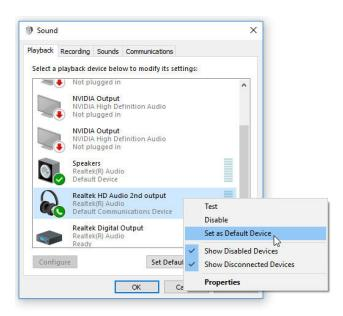

# **1-2 Configuring S/PDIF Out**

The S/PDIF Out jack can transmit audio signals to an external decoder for decoding to get the best audio quality.

### **1. Connecting a S/PDIF Out Cable:**

Connect a S/PDIF optical cable to an external decoder for transmitting the S/PDIF digital audio signals.

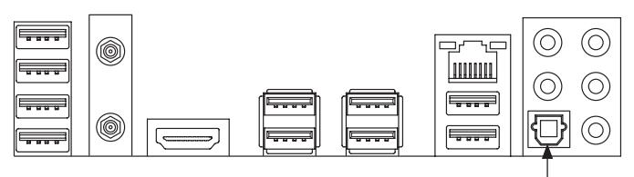

Connects to a S/PDIF optical cable

# **2. Configuring S/PDIF Out:**

On the **Realtek Digital Output** screen, Select the sample rate and bit depth in the **Default Format** section.

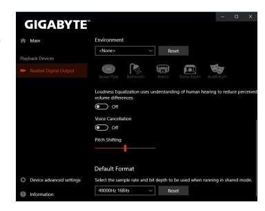

# **1-3 Stereo Mix**

The following steps explain how to enable Stereo Mix (which may be needed when you want to record sound from your computer).

### Step 1:

Locate the icon in the notification area and right-click on the icon. Select **Open Sound settings**.

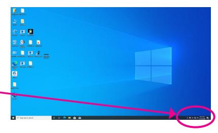

Step 2: Select **Sound Control Panel.**

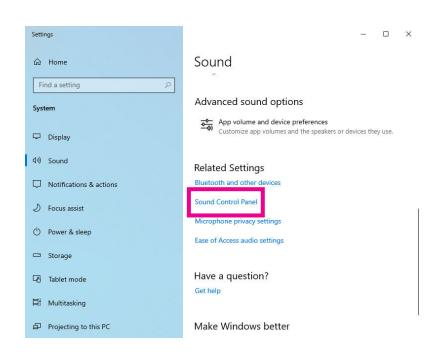

Step 3:

On the **Recording** tab, right-click on **Stereo Mix** itemand select **Enable**. Then set it as the default device. (if you do not see **Stereo Mix**, right-click on an empty space and select **Show Disabled Devices**.)

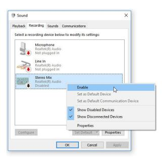

Step 4:

Now you can access the **HD Audio Manager** to configure **Stereo Mix** and use **Voice Recorder** to record the sound.

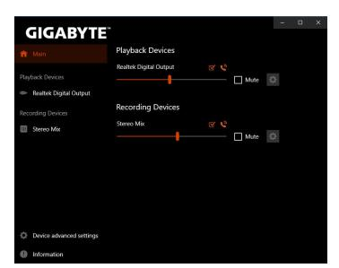

# **1-4 Using the Voice Recorder**

After setting up the audio input device, to open the **Voice Recorder,** go to the Start menu and search for **Voice Recorder**.

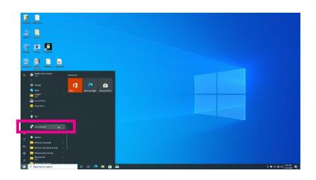

### **A. Recording Audio**

- 1. To begin the recording, click the **Record** icon .
- 2. To stop the recording, click the **Stop recording** icon .

### **B. Playing the Recorded Sound**

The recordings will saved in Documents>Sound Recordings. Voice Recorder records audio in MPEG-4 (.m4a) format. You can play the recording with a digital media player program that supports the audio file format.

#### **1-5 DTS:X® Ultra**

Hear what you have been missing! DTS:X® Ultra technology is designed to enhance your gaming, movies, AR, and VR experiences on headphones and speakers. It delivers an advanced audio solution that renders sounds above, around, and close to you, stepping up your game play to new levels. Now with support for Microsoft Spatial sound. Key features include:

### **• Believable 3D audio**

 DTS latest spatial audio rendering that delivers believable 3D audio over headphones and speakers.

### **• PC sound gets real**

 DTS:X decoding technology places sound where it would occur naturally in the real world.

**• Hear sound as it was intended** Speaker and headphone tuning that preserves the audio experience as it was designed.

### **A. Using DTS:X Ultra**

### Step 1:

After you install the included motherboard drivers, make sure your Internet connection works properly. The system will automatically install DTS: X Ultra from the Microsoft Store. Restart the system after it is installed.

### Step 2:

Connect your audio device and select **DTS:X Ultra** on the Start menu. The **Content Mode** main menu allows you to select content modes including Music, Video, and Movies, or you can select specifically tuned sound modes, including Strategy, RPG, and Shooter, to suit different game genres. The **Custom Audio** allows you to create customized audio profiles based on personal preference for later use.

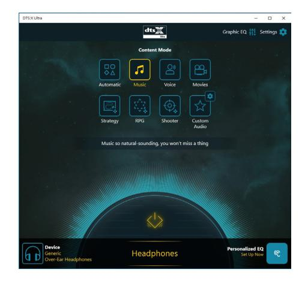

# **B. Using DTS Sound Unbound**

# **Installing DTS Sound Unbound**

### Step 1:

Connect your headphones to the front panel line out jack and make sure your Internet connection works properly, Locate the icon in the notification area and right-click on the icon. Click on **Spatial Sound** and then select **DTS Sound Unbound**.

### Step 2:

The system will connect to the Microsoft Store. When the DTS Sound Unbound application appears, click **Install** and follow the on-screen instructions to proceed with the installation.

## Step 3:

After the DTS Sound Unbound application is installed, click **Launch**. Accept the **End User License Agreement** and restart the system.

### Step 4:

Select **DTS Sound Unbound** on the Start menu. DTS Sound Unbound allows you to use the DTS Headphone:X and DTS:X features.

# **ESS ES9280AC DAC chip + ESS ES9080 chip**

# **Configuring the Audio Input and Output**

To manage audio settings for the line out or mic in jack on the back panel, refer to the steps below:

Step 1: Locate the icon in the notification area and right-click on the icon. Select **Open Sound settings**.

Step 2: Select **Sound Control Panel.**

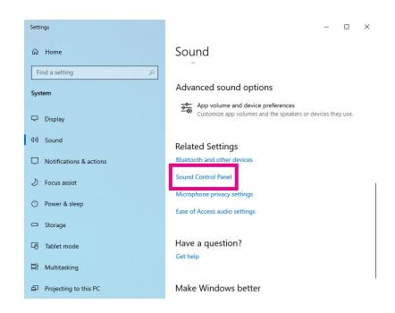

Step 3: This page provides audio jack related configuration options.

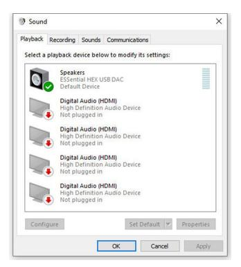