# **Configuring a RAID Set (AM5 Series)**

| RAID Levels                                    | 2 |
|------------------------------------------------|---|
|                                                |   |
| Preparing the Hard Drives and BIOS Settings    | 2 |
| A. Installing hard drives                      |   |
| B. Configuring controller mode in BIOS Setup   |   |
| C. RAID Configuration                          |   |
|                                                |   |
| nstalling the RAID Driver and Operating System | 7 |
| A. Installing the Operating System             | 7 |
| B. Rebuilding an Array                         |   |

# **RAID Levels**

|                                     | RAID 0                                                   | RAID 1                        | RAID 5 (Note 1)                                               | RAID 10                                                      |
|-------------------------------------|----------------------------------------------------------|-------------------------------|---------------------------------------------------------------|--------------------------------------------------------------|
| Minimum Number of Hard Drives | ≥2                                                       | 2                             | ≥3                                                            | 4                                                            |
| Array Capacity                      | Number of hard drives * Size of the smallest drive | Size of the smallest drive | (Number of hard drives -1) * Size of the smallest drive | (Number of hard drives/2) * Size of the smallest drive |
| Fault Tolerance                     | No                                                       | Yes                           | Yes                                                           | Yes                                                          |

#### **To configure a RAID set, follow the steps below:**

- A. Install hard drive(s) in your computer.
- B. Configure controller mode in BIOS Setup.
- C. Configure a RAID array in RAID BIOS
- D. Install the RAID driver and operating system

## **Before you begin**

- SATA hard drives or SSDs. (Note 2) To ensure optimal performance, it is recommended that you use two hard drives with identical model and capacity. (Note 3)
- A Windows setup disc.
- An Internet connected computer.
- A USB thumb drive.

# **Preparing the Hard Drives and BIOS Settings**

### **A. Installing hard drives**

Install the hard drives/SSDs in the SATA/M.2 connectors on the motherboard. Then connect the power connectors from your power supply to the hard drives.

- (Note 1) Only available on NVMe SSDs with the AMD Ryzen™ 9000 Series Processors.
- (Note 2) An M.2 PCIe SSD cannot be used to set up a RAID set either with an M.2 SATA SSD or a SATA hard drive.
- (Note 3) Refer to the "Internal Connectors" section of the user's manual for the installation notices for the M.2, and SATA connectors.

# **B. Configuring controller mode in BIOS Setup**

Step:

Turn on your computer and press <Delete> to enter BIOS Setup during the POST (Power-On Self-Test). Under **Settings\IO Ports,** set **SATA Configuration\SATA Mode** to **RAID** (Figure 1). Then save the settings and restart your computer. (If you want to use NVMe PCIe SSDs to configure RAID, make sure to set **NVMe RAID mode** to **Enabled**.)

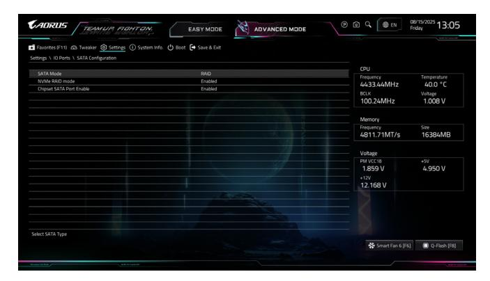

Figure 1

## **C. RAID Configuration**

Step 1:

In BIOS Setup, go to **Boot** and set **CSM Support** to **Disabled** (Figure 2). Save the changes and exit BIOS Setup.

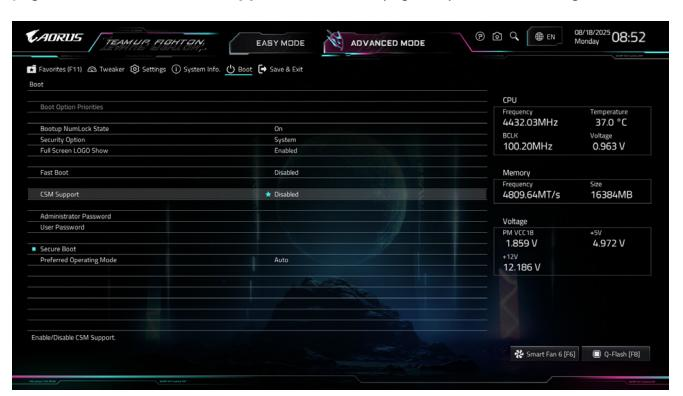

Figure 2

The BIOS Setup menus described in this section may differ from the exact settings for your motherboard. The actual BIOS Setup menu options you will see shall depend on the motherboard you have and the BIOS version.

#### Step 2:

After the system reboot, enter BIOS Setup again. Then enter the **Settings\IO Ports\RAIDXpert2 Configuration Utility** sub-menu (Figure 3).

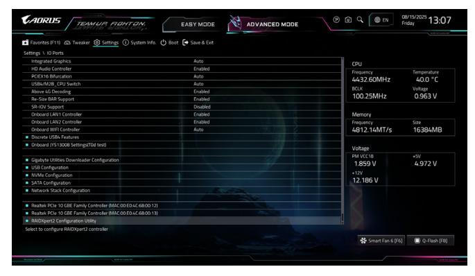

Figure 3

## Step 3:

On the RAIDXpert2 Configuration Utility screen, press <Enter> on **Array Management** to enter the **Create Array** screen. Then, select a RAID level (Figure 4).Options include RAIDABLE (Note 1), RAID 0, RAID 1, RAID 5 (Note 2), and RAID 10 (the selections available depend on the number of the hard drives being installed). Next, press <Enter> on **Select Physical Disks** to enter the **Select Physical Disks** screen.

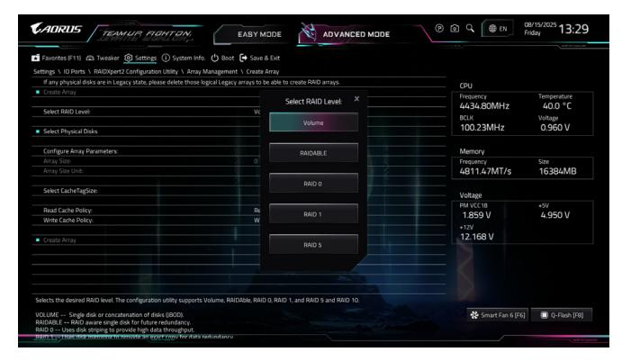

Figure 4

(Note 1) If you want to install the operating system onto a single drive/SSD first, select **RAIDABLE** mode. (Note 2) Only available on NVMe SSDs with the AMD Ryzen™ 9000 Series Processors.

#### Step 4:

On the **Select Physical Disks** screen, select the hard drives to be included in the RAID array and set them to **Enabled**. Next, use the down arrow key to move to **Apply Changes** and press <Enter> (Figure 5).Then return to the previous screen and set the **Array Size**, **Array Size Unit**, **Read Cache Policy** and **Write Cache Policy**.

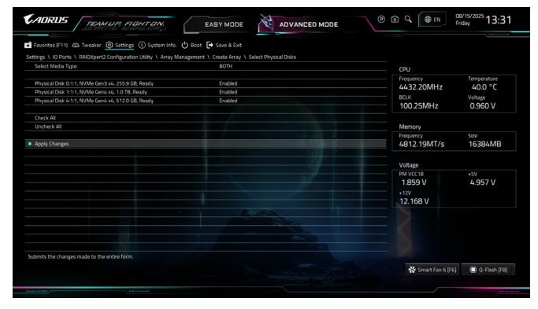

Figure 5

#### Step 5: After setting the capacity, move to **Create Array** and press <Enter> to begin. (Figure 6)

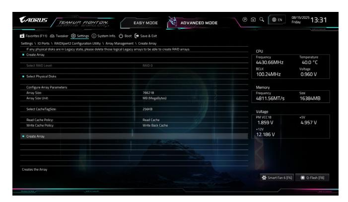

Figure 6

After completing, you'll be brought back to the **Array Management** screen. Under **Manage Array Properties** you can see the new RAID volume and information on RAID level, array name, array capacity, etc. (Figure 7)

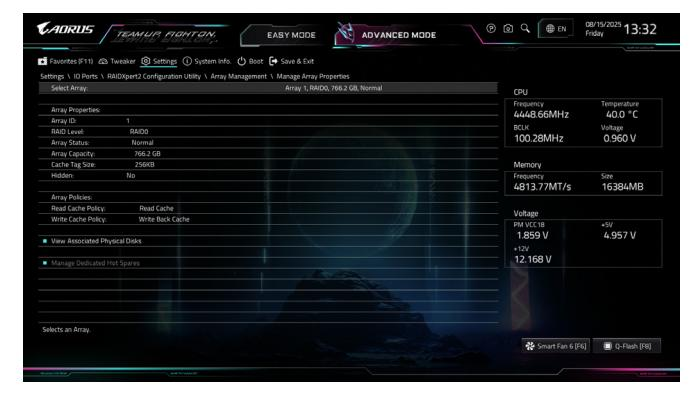

Figure 7

#### **Delete RAID Volume**

To delete a RAID array, select the array to be deleted on the **RAIDXpert2 Configuration Utility\Array Management\Delete Array** screen. Press <Enter> on **Delete Array(s)** to enter the **Delete** screen. Then set **Confirm** to **Enabled** and press <Enter> on **Yes** (Figure 8).

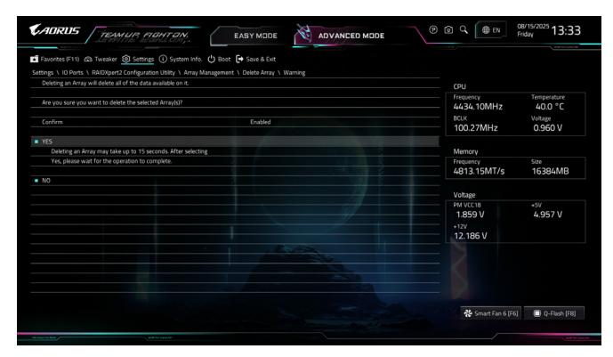

Figure 8

# **Installing the RAID Driver and Operating System**

With the correct BIOS settings, you are ready to install the operating system.

## **A. Installing the Operating System**

As some operating systems already include RAID driver, you do not need to install separate RAID driver during the Windows installation process. After the operating system is installed, we recommend that you install all required drivers from the GIGABYTE Control Center to ensure system performance and compatibility. If the operating system to be installed requires that you provide additional RAID driver during the OS installation process, please refer to the steps below:

#### Step 1:

Go to GIGABYTE's website, browse to the motherboard model's web page, download the **AMD RAID Preinstall Driver** file on the **Support\Download\SATA RAID/AHCI** page, unzip the file and copy the files to your USB thumb drive.

#### Step 2:

Boot from the Windows setup disc and perform standard OS installation steps. When the screen requesting you to load the driver appears, select **Browse**.

#### Step 3:

Insert the USB thumb drive and then browse to the location of the drivers. Follow the on-screen instructions to install the following three drivers in order.

- j **AMD-RAID Bottom Device**
- k **AMD-RAID Controller**
- l **AMD-RAID Config Device**

Finally, continue the OS installation.

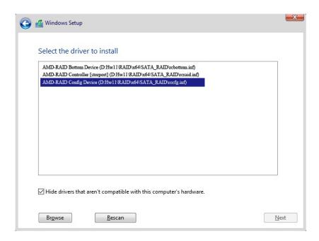

# **B. Rebuilding an Array**

Rebuilding is the process of restoring data to a hard drive from other drives in the array. Rebuilding applies only to fault-tolerant arrays such as RAID 1 and RAID 10 arrays. To replace the old drive, make sure to use a new drive of equal or greater capacity. The procedures below assume a new drive is added to replace a failed drive to rebuild a RAID 1 array.

While in the operating system, make sure the Chipset and RAID drivers have been installed.

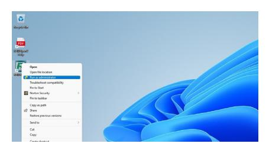

Step 1: Right-click on the **RAIDXpert2** icon on the desktop and then select **Run as administrator** to launch the **AMD RAIDXpert2** utility.

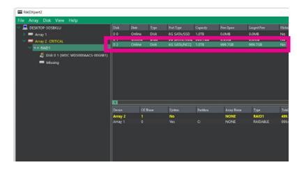

Step 2: In the disk devices section, left-click your mouse twice on the newly-added hard drive.

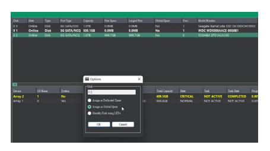

Step 3: On the next screen, select **Assign as Global Spare** and click **OK**.

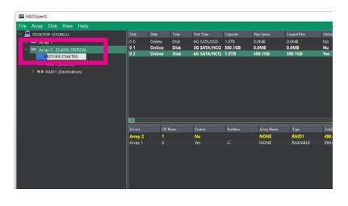

Step 4: You can check the current progress in the active volumes section on the bottom or left of the screen.

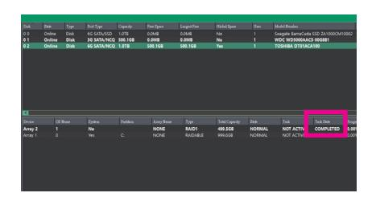

Step 5: Then rebuild is complete when the **Task State** column shows "COMPLETED."