# **BIOS Setup (AMD 800 Series)**

| BIOS Setup      |    |
|-----------------|----|
| Startup Screen  |    |
| The Main Menu   |    |
| Smart Fan 6     |    |
| Favorites (F11) |    |
| Tweaker         | (  |
| Settings        |    |
| System Info.    |    |
| Boot            |    |
| Save & Exit     | 26 |

The BIOS Setup menus and options described in this chapter may differ from the exact settings for your motherboard. The actual BIOS Setup menu options are dependent on the motherboard you have and the BIOS version.

## **BIOS Setup**

BIOS (Basic Input and Output System) records hardware parameters of the system in the CMOS on the motherboard. Its major functions include conducting the Power-On Self-Test (POST) during system startup, saving system parameters and loading operating system, etc. BIOS includes a BIOS Setup program that allows the user to modify basic system configuration settings or to activate certain system features.

When the power is turned off, the battery on the motherboard supplies the necessary power to the CMOS to keep the configuration values in the CMOS.

To access the BIOS Setup program, press the <Delete> key during the POST when the power is turned on.

To upgrade the BIOS, use either the GIGABYTE Q-Flash or Q-Flash Plus utility.

- Q-Flash allows the user to quickly and easily upgrade or back up BIOS without entering the operating system.
- Q-Flash Plus allows you to update the BIOS when your system is off (S5 shutdown state). Save the latest BIOS on a USB thumb drive and plug it into the dedicated port, and then you can now flash the BIOS automatically by simply pressing the Q-Flash Plus button.

For instructions on using the Q-Flash and Q-Flash Plus utilities, please navigate to the "Unique Features" page of GIGABYTE's website and search for "BIOS Update Utilities."

- Because BIOS flashing is potentially risky, if you do not encounter problems using the current version of BIOS, it is recommended that you not flash the BIOS. To flash the BIOS, do it with caution. Inadequate BIOS flashing may result in system malfunction.
- It is recommended that you not alter the default settings (unless you need to) to prevent system instability or other unexpected results. Inadequately altering the settings may result in system's failure to boot. If this occurs, try to clear the CMOS values and reset the board to default values.
- Refer to the introductions of the battery/clear CMOS jumper/battery in user's manual or refer to the "Load Optimized Defaults" section for how to clear the CMOS values.

## **Startup Screen**

The following startup Logo screen will appear when the computer boots. (The screen may vary from motherboards.)

#### **Function Keys:**

#### **<DEL>: BIOS SETUP\Q-FLASH**

Press the <Delete> key to enter BIOS Setup or to access the Q-Flash utility in BIOS Setup.

#### **<F12>: BOOT MENU**

Boot Menu allows you to set the first boot device without entering BIOS Setup. In Boot Menu, use the up arrow key <h> or the down arrow key <i> to select the first boot device, then press <Enter> to accept. The system will boot from the device immediately.

Note: The setting in Boot Menu is effective for one time only. After system restart, the device boot order will still be based on BIOS Setup settings.

#### **<END>: Q-FLASH**

Press the <End> key to access the Q-Flash utility directly without having to enter BIOS Setup first.

## **The Main Menu**

### **Advanced Mode**

The Advanced Mode provides detailed BIOS settings. You can press the arrow keys on your keyboard to move among the items and press <Enter> to accept or enter a sub-menu. Or you can use your mouse to select the item you want.

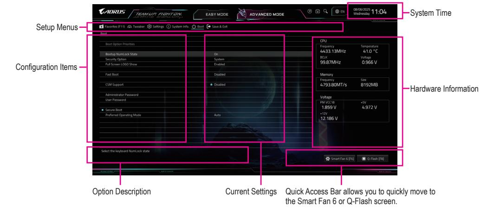

## **Advanced Mode Function Keys**

| <f><g></g></f>               | Move the selection bar to select a setup menu                        |
|------------------------------|----------------------------------------------------------------------|
| <h><i></i></h>               | Move the selection bar to select an configuration item on a menu     |
| <enter>/Double Click</enter> | Execute command or enter a menu                                      |
| <+>/ <page up=""></page>     | Increase the numeric value or make changes                           |
| <->/ <page down=""></page>   | Decrease the numeric value or make changes                           |
| <f1></f1>                    | Show descriptions of the function keys                               |
| <f2></f2>                    | Switch to Easy Mode                                                  |
| <f3></f3>                    | Save the current BIOS settings to a profile                          |
| <f4></f4>                    | Load the BIOS settings from a profile created before                 |
| <f5></f5>                    | Restore the previous BIOS settings for the current submenus          |
| <f6></f6>                    | Display the Smart Fan 6 screen                                       |
| <f7></f7>                    | Load the Optimized BIOS default settings for the current submenus    |
| <f8></f8>                    | Access the Q-Flash utility                                           |
| <f10></f10>                  | Save all the changes and exit the BIOS Setup program                 |
| <f11></f11>                  | Switch to the Favorites submenu                                      |
| <f12></f12>                  | Capture the current screen as an image and save it to your USB drive |
| <insert></insert>            | Add or remove a favorite option                                      |
| <ctrl>+<s></s></ctrl>        | Display information on the installed memory                          |
| <esc></esc>                  | Main Menu: Exit the BIOS Setup program                               |
|                              | Submenus: Exit current submenu                                       |
|                              |                                                                      |

## **Easy Mode**

Easy Mode allows users to quickly view their current system information or to make adjustments for optimum performance. In Easy Mode, you can use your mouse to move through configuration items or press <F2> to switch to the Advanced Mode screen.

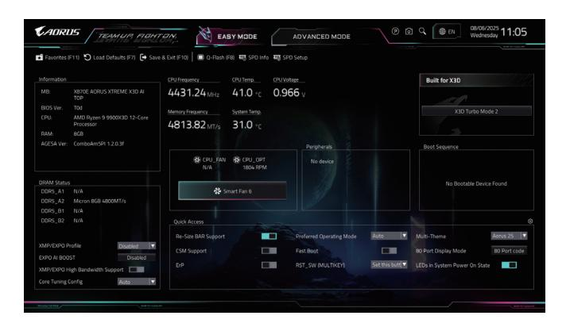

## **Smart Fan 6**

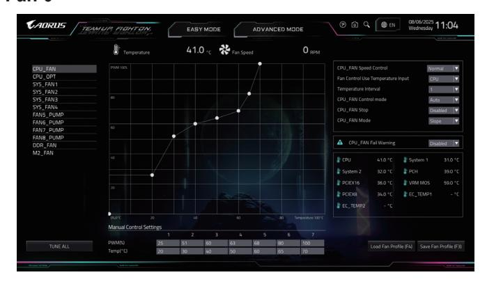

Use the <F6> function key to quickly switch to this screen. This screen allows you to configure fan speed related settings for each fan header or monitor your system/CPU temperature.

## & **TUNE ALL**

Allows you to apply the current settings to all fan headers.

#### & **Temperature**

Displays the current temperature of the selected target area.

#### & **Fan Speed**

Displays current fan/pump speeds.

### & **Flow Rate**

Displays the flow rate of your water cooling system. Press <Enter> on **Fan Speed** to switch to this function.

### & **Fan Speed Control**

Allows you to determine whether to enable the fan speed control function and adjust the fan speed.

Normal Allows the fan to run at different speeds according to the CPU temperature.

Silent Allows the fan to run at slow speeds.

Manual Allows you to drag the curve nodes to adjust fan speed. Or you can use the **EZ Tuning**

feature. After adjusting the node position, press **Apply** to automatically calculate the

slope of the curve.

Full Speed Allows the fan to run at full speeds.

### & **Fan Control Use Temperature Input**

Allows you to select the reference temperature for fan speed control.

#### & **Temperature Interval**

Allows you to select the temperature interval for fan speed change.

### & **FAN/PUMP Control Mode**

Auto Lets the BIOS automatically detect the type of fan installed and sets the optimal control

mode.

Voltage Voltage mode is recommended for a 3-pin fan/pump. PWM PWM mode is recommended for a 4-pin fan/pump.

## & **FAN/PUMP Stop**

Enables or disables the fan/pump stop function. You can set the temperature limit using the temperature curve. The fan or pump stops operation when the temperature is lower than the limit.

### & **FAN/PUMP Mode**

Allows you to set the operating mode for the fan.

Slope Adjusts the fan speed linearly based on the temperature. Stair Adjusts the fan speed stepwise based on the temperature.

## & **FAN/PUMP Fail Warning**

Allows the system to emit warning sound if the fan/pump is not connected or fails. Check the fan/pump condition or fan/pump connection when this occurs.

## & **Save Fan Profile (F3)**

This function allows you to save the current settings to a profile. You can save the profile in the BIOS or select **Select File in HDD/FDD/USB** to save the profile to your storage device.

## & **Load Fan Profile (F4)**

This function allows you to load a previously saved BIOS profile without the hassles of reconfiguring the BIOS settings. Or you can select **Select File in HDD/FDD/USB** to load a profile from your storage device.

## **Favorites (F11)**

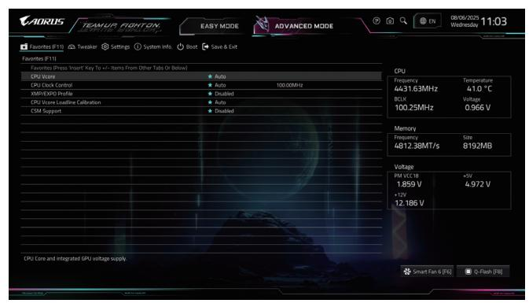

Set your frequently used options as your favorites and use the <F11> key to quickly switch to the page where all of your favorite options are located. To add or remove a favorite option, go to its original page and press <Insert> on the option. The option is marked with a star sign if set as a "favorite."

## **Tweaker**

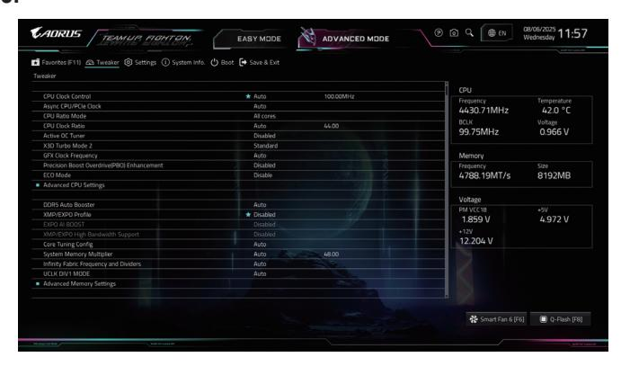

Whether the system will work stably with the overclock/overvoltage settings you made is dependent on your overall system configurations. Incorrectly doing overclock/overvoltage may result in damage to CPU, chipset, or memory and reduce the useful life of these components. This page is for advanced users only and we recommend you not to alter the default settings to prevent system instability or other unexpected results. (Inadequately altering the settings may result in system's failure to boot. If this occurs, clear the CMOS values and reset the board to default values.)

## & **CPU Clock Control**

Allows you to manually set the CPU base clock in 0.01 MHz increments. **Important:** It is highly recommended that the CPU frequency be set in accordance with the CPU specifications.

## & **Async CPU/PCIe Clock**

Allows for asynchronous CPU/PCIe clock.

## & **CPU Ratio Mode**

Allows you to set the core ratio for all CPU cores or individual cores.

## & **CPU Clock Ratio**

Allows you to alter the clock ratio for the installed CPU. The adjustable range is dependent on the CPU being installed.

#### & **Active OC Tuner**

Enables or disables the Active OC Tuner feature.

## & **X3D Turbo Mode 2**

Allows you to adjust the X3D Turbo mode when using a CPU that supports the X3D Turbo feature. Depending on the selected mode, the system load is dynamically monitored to enhance gaming performance. Performance enhancement may vary depending on the CPU and memory used.

#### & **GFX Clock Frequency**

Allows you to alter the frequency for the GPU.

NOTE: The adjustable range is dependent on the CPU being installed. **Auto** lets the BIOS automatically configure this setting.

Some of the BIOS settings are available only when the motherboard chipset and the CPU/memory used support the feature. For more information about AMD CPUs' unique features, please visit AMD's website.

## & **Precision Boost Overdrive(PBO) Enhancement**

Offers five boost levels for three targeted 90/80/70 °C CPU temperature. One can choose the most suitable thermal limit/boost level combinations to reach higher CPU frequency. Note: Workable settings/results may vary by different CPUs' condition.

#### & **ECO Mode**

Allows you to adjust CPU control limits to operate within the specified thermal design power range. The selected power level requires a compatible motherboard and cooling solution.

#### **Advanced CPU Settings**

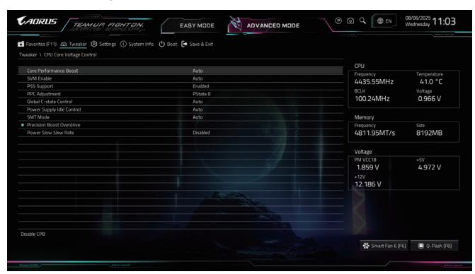

## & **Core Performance Boost**

Allows you to determine whether to enable the Core Performance Boost (CPB) technology, a CPU performance-boost technology.

#### & **SVM Enable**

Virtualization enhanced by Virtualization Technology will allow a platform to run multiple operating systems and applications in independent partitions. With virtualization, one computer system can function as multiple virtual systems.

## & **PSS Support**

Enables or disables the generation of ACPI\_PPC, \_PSS, and \_PCT objects.

#### & **PPC Adjustment**

Allows you to fix the PState of the CPU.

#### & **Global C-state Control**

Allows you to determine whether to let the CPU enter C states. When enabled, the CPU core frequency will be reduced during system halt state to decrease power consumption.

#### & **Power Supply Idle Control**

Enables or disables Package C6 State.

Typical Current Idle Disables this function.

Low Current Idle Enables this function.

Auto Lets the BIOS automatically configure this setting.

#### & **SMT Mode**

Allows you to enable or disable the CPU Simultaneous Multi-Threading technology.

## **Precision Boost Overdrive**

Allows you to determine whether to automatically increase CPU clock and working performance.

## & **Power Slow Slew Rate**

Allows you to select a different level of Power Slot Slew Rate.

## & **DDR5 Auto Booster**

Enables or disables the DDR5 Dynamic Turbo Boost feature, which allows automatic switching between default frequency and boosted frequency. **Auto** lets the BIOS automatically configure this setting.

## & **XMP/EXPO Profile**

Allows the BIOS to read the SPD data on XMP/EXPO memory module(s) to enhance memory performance when enabled. Selections are available only when an XMP or EXPO memory module is installed.

## & **EXPO AI BOOST**

Allows you to configure memory performance enhancements using the AORUS AI SNATCH software within the operating system.

## & **XMP/EXPO High Bandwidth Support**

Enables or disables high bandwidth memory mode. Selections are available only when an XMP or EXPO memory module is installed.

#### & **Core Tuning Config**

Allows the system to turn processor core-related settings to suit different usage scenarios.

#### & **System Memory Multiplier**

Allows you to set the system memory multiplier. **Auto** sets memory multiplier according to memory SPD data.

## & **Infinity Fabric Frequency and Dividers**

Allows you to set the FCLK frequency.

## & **UCLK DIV1 MODE**

Allows you to specify the UCLK DIV1 mode.

## **Advanced Memory Settings**

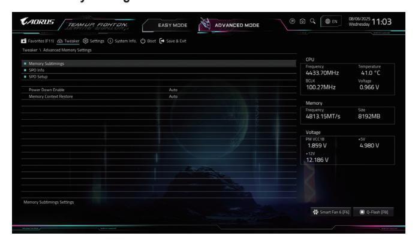

## **Memory Subtimings**

### d **Standard Timing Control/Advanced Timing Control/CAD Bus Configuration**

These sections provide memory timing settings. Note: Your system may become unstable or fail to boot after you make changes on the memory timings. If this occurs, please reset the board to default values by loading optimized defaults or clearing the CMOS values.

## **SPD Info**

Displays information on the installed memory.

## **SPD Setup**

Allows you to configure memory parameters for the installed memory.

#### & **Power Down Enable**

Enables or disables Power Down support.

#### & **Memory Context Restore**

Allows you to configure the memory context restore mode. When enabled, DRAM re-retraining is avoided when possible and the POST latency is minimized.

## & **CPU Vcore/Dynamic Vcore(DVID)/VCORE SOC/Dynamic VCORE SOC(DVID)/ CPU\_VDDIO\_MEM/DDR\_VDD Voltage/DDR\_VDDQ Voltage/DDR\_VPP Voltage**

These items allow you to adjust the CPU Vcore and memory voltages. The displayed items values may vary depending on motherboard chipset and the CPU used.

## **Advanced Voltage Settings**

Allows you to adjust the VDDP and other voltage settings.

#### **CPU/VRM Settings**

This submenu allows you to configure Load-Line Calibration level.

## **Settings**

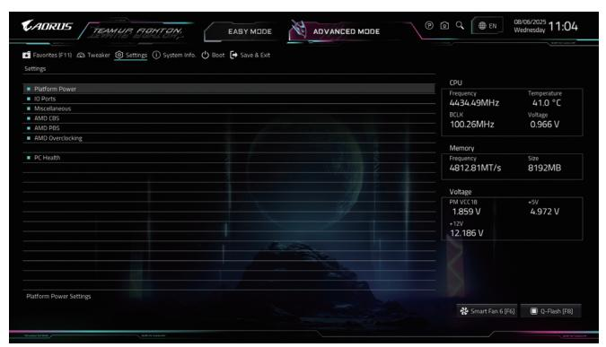

## **Platform Power**

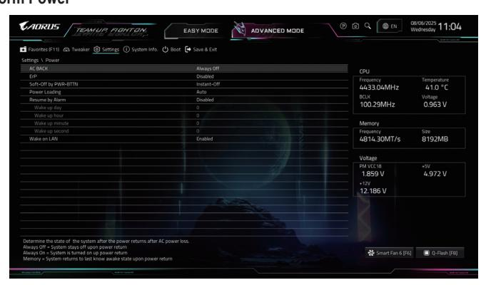

## & **AC BACK**

Determines the state of the system after the return of power from an AC power loss.

Memory The system returns to its last known awake state upon the return of the AC power.

Always On The system is turned on upon the return of the AC power.

Always Off The system stays off upon the return of the AC power.

## & **ErP**

Determines whether to let the system consume least power in S5 (shutdown) state. Note: When this item is set to **Enabled**, the Resume by Alarm function becomes unavailable.

#### & **Soft-Off by PWR-BTTN**

Configures the way to turn off the computer in MS-DOS mode using the power button.

Instant-Off Press the power button and then the system will be turned off instantly.

Delay 4 Sec. Press and hold the power button for 4 seconds to turn off the system. If the power

button is pressed for less than 4 seconds, the system will enter suspend mode.

#### & **Power Loading**

Enables or disables dummy load. When the power supply is at low load, a self-protection will activate causing it to shutdown or fail. If this occurs, please set to **Enabled**. **Auto** lets the BIOS automatically configure this setting.

## & **Resume by Alarm**

Determines whether to power on the system at a desired time.

If enabled, set the date and time as following:

- Wake up day: Turn on the system at a specific time on each day or on a specific day in a month.
- Wake up hour/minute/second: Set the time at which the system will be powered on automatically. Set the time at which the system will be powered on automatically.

Note: When using this function, avoid inadequate shutdown from the operating system or removal of the AC power, or the settings may not be effective.

## & **Wake on LAN**

Enables or disables the wake on LAN function.

## **IO Ports**

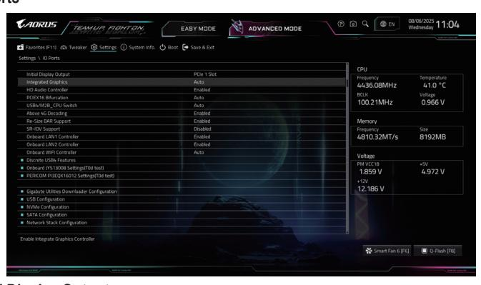

#### & **Initial Display Output**

Specifies the first initiation of the monitor display from the installed PCI Express graphics card or the onboard graphics.

IGD Video Sets the onboard graphics as the first display. (This item is present only when

you install a CPU that supports this feature.)

PCIe 1 Slot Sets the graphics card on the PCIEX16 slot as the first display.

#### & **Integrated Graphics**

Enables or disables the onboard graphics function. This item is present only when you install a CPU that supports this feature.

Auto The BIOS will automatically enable or disable the onboard graphics

depending on the graphics card being installed.

Forces Enables the onboard graphics. Disabled Disables the onboard graphics.

#### & **UMA Mode**

Specify the UMA mode.

Auto Lets the BIOS automatically configure this setting.

UMA Specified Sets the UMA Frame Buffer Size. UMA Auto Sets the display resolution.

UMA Game Optimized Adjusts the frame buffer size based on the total system memory size.

This item is configurable only when **Integrated Graphics** is set to **Forces**.

## & **UMA Frame Buffer Size**

UMA Frame buffer Size is the total amount of system memory allocated solely for the onboard graphics controller. MS-DOS, for example, will use only this memory for display. Options are: Auto (default), 64M~16G. This item is configurable only when **UMA Mode** is set to **UMA Specified**.

#### & **HD Audio Controller**

Enables or disables the onboard audio function.

If you wish to install a 3rd party add-in audio card instead of using the onboard audio, set this item to **Disabled**.

## & **PCIEX16 Bifurcation**

Allows you to determine how the bandwidth of the PCIEX16 slot is divided. The adjustable range may vary by CPU.

## & **USB4/M2B\_CPU Switch**

Allows you to configure bandwidth sharing between the USB4® USB Type-C® port and the M2B\_CPU connector.

## & **Above 4G Decoding**

Enables or disables 64-bit capable devices to be decoded in above 4 GB address space (only if your system supports 64-bit PCI decoding). Set to **Enabled** if more than one advanced graphics card are installed and their drivers are not able to be launched when entering the operating system (because of the limited 4 GB memory address space).

#### & **Re-Size BAR Support**

Enables or disables support for Resizable BAR.

## & **SR-IOV Support**

Enables or disables support for Single Root IO Virtualization.

## & **Onboard LAN Controller**

Enables or disables the onboard LAN function.

If you wish to install a 3rd party add-in network card instead of using the onboard LAN, set this item to **Disabled**.

## & **Onboard WIFI Controller**

Enables or disables the onboard WIFI function.

#### **Discrete USB4 Features**

Allows you to configure various functions related to the discrete USB4 controller, such as adjusting USB4 support status, viewing firmware version, and setting parameters like XHCI port speed, USB4/TBT boot delay timing, PCIe FPB support, and PCIe restore mode under the S3 power state.

## **Gigabyte Utilities Downloader Configuration**

#### & **Gigabyte Utilities Downloader Configuration**

Allows you to determine whether to automatically download and install GIGABYTE Control Center after entering the operating system. Before the installation, make sure the system is connected to the Internet.

#### **USB Configuration**

#### & **Legacy USB Support**

Allows USB keyboard/mouse to be used in MS-DOS.

#### & **XHCI Hand-off**

Determines whether to enable XHCI Hand-off feature for an operating system without XHCI Hand-off support.

## & **USB Mass Storage Driver Support**

Enables or disables support for USB storage devices.

## & **Port 60/64 Emulation**

Enables or disables emulation of I/O ports 64h and 60h. This should be enabled for full legacy support for USB keyboards/mice in MS-DOS or in operating system that does not natively support USB devices.

#### & **Mass Storage Devices**

Displays a list of connected USB mass storage devices. This item appears only when a USB storage device is installed.

### **NVMe Configuration**

Displays information on your M.2 NVME PCIe SSD if installed.

## **SATA Configuration**

#### & **SATA Mode**

Enables or disables RAID for the SATA controllers integrated in the Chipset or configures the SATA controllers to AHCI mode.

RAID Enables RAID for the SATA controller.

AHCI Configures the SATA controllers to AHCI mode. Advanced Host Controller Interface

(AHCI) is an interface specification that allows the storage driver to enable advanced

Serial ATA features such as Native Command Queuing and hot plug.

## & **NVMe RAID mode**

Allows you to determine whether to use your M.2 NVMe PCIe SSDs to configure RAID.

### & **Chipset SATA Port Enable**

Enables or disables the integrated SATA controllers.

#### & **Chipset SATA Port Hot plug**

Enables or disable the hot plug capability for each SATA port.

#### & **Chipset SATA Port**

Displays the information of the connected SATA device(s).

#### **Network Stack Configuration**

#### & **Network Stack**

Disables or enables booting from the network to install a GPT format OS, such as installing the OS from the Windows Deployment Services server.

#### & **IPv4 PXE Support**

Enables or disables IPv4 PXE Support. This item is configurable only when **Network Stack** is enabled.

#### & **IPv4 HTTP Support**

Enables or disables HTTP boot support for IPv4. This item is configurable only when **Network Stack** is enabled.

#### & **IPv6 PXE Support**

Enables or disables IPv6 PXE Support. This item is configurable only when **Network Stack** is enabled.

#### & **IPv6 HTTP Support**

Enables or disables HTTP boot support for IPv6. This item is configurable only when **Network Stack** is enabled.

## & **PXE boot wait time**

Allows you to configure how long to wait before you can press <Esc> to abort the PXE boot. This item is configurable only when **Network Stack** is enabled.

## & **Media detect count**

Allows you to set the number of times to check the presence of media. This item is configurable only when **Network Stack** is enabled.

## **Ethernet Controller / PCIe GBE Family Controller**

This sub-menu provides information on LAN configuration and related configuration options.

## **Miscellaneous**

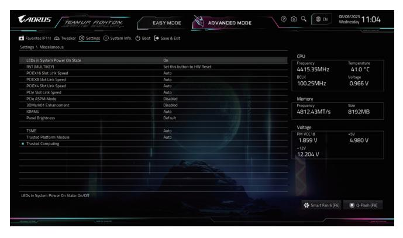

### & **LEDs in System Power On State**

Allows you to enable or disable motherboard LED lighting when the system is on.

Off Disables the selected lighting mode when the system is on. On Enables the selected lighting mode when the system is on.

## & **RST (MULTIKEY)**

Allows you to configure the function of the system reset button.

HW Reset Use the button to reset the system.

LED On/Off Use the button to toggle the motherboard LED lights.

BIOS Setup Use the button to enter the BIOS Setup.

Safe Mode Use the button to boot the system into Safe Mode.

## & **PCIEX16 Slot Link Speed**

Allows you to set the operation mode of the PCIEX16 slot. Actual operation mode is subject to the hardware specification of each slot. **Auto** lets the BIOS automatically configure this setting.

#### & **PCIEX8 Slot Link Speed**

Allows you to set the operation mode of the PCIEX8 slot. Actual operation mode is subject to the hardware specification of each slot. **Auto** lets the BIOS automatically configure this setting.

## & **PCIEX4 Slot Link Speed**

Allows you to set the operation mode of the PCIEX4 slot. Actual operation mode is subject to the hardware specification of each slot. **Auto** lets the BIOS automatically configure this setting.

#### & **PCIe Slot Link Speed**

Allows you to set the operation mode of the PCI Express slots and M.2 connectors. Actual operation mode is subject to the hardware specification of each slot. **Auto** lets the BIOS automatically configure this setting.

#### & **PCIe ASPM Mode**

Allows you to configure the ASPM mode for the device connected to the CPU/Chipset PCI Express bus.

#### & **3DMark01 Enhancement**

Allows you to determine whether to enhance some legacy benchmark performance.

#### & **IOMMU**

Enables or disables AMD IOMMU support.

#### & **Panel Brightness**

Allows you to set the brightness of the LCD panel on the motherboard. This item is only present on models that have an LCD panel.

## & **TSME**

Enables or disables TSME support.

## & **Trusted Platform Module**

Allows you to configure the TPM function.

Auto Lets the BIOS automatically configure this setting.

Disabled Disables this function.

Enable dTPM Enables the TPM function provided by the TPM module (optional) installed in the

SPI\_TPM header.

Enable ASP fTPM Enables AMD CPU fTPM.

Enable Pluton fTPM Enables the Pluton TPM function.

### **Trusted Computing**

Enables or disables Trusted Platform Module (TPM).

## **AMD CBS**

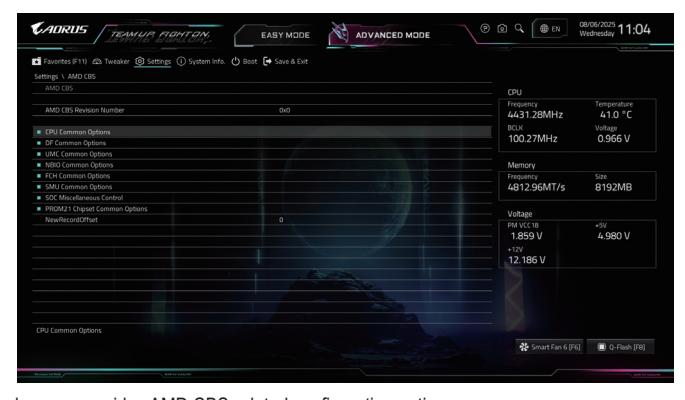

This sub-menu provides AMD CBS-related configuration options.

## **AMD PBS**

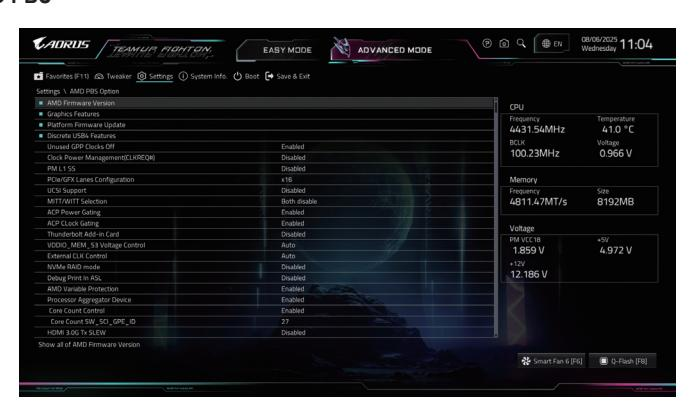

This sub-menu provides specific option settings for the AMD platform.

## **AMD Overclocking**

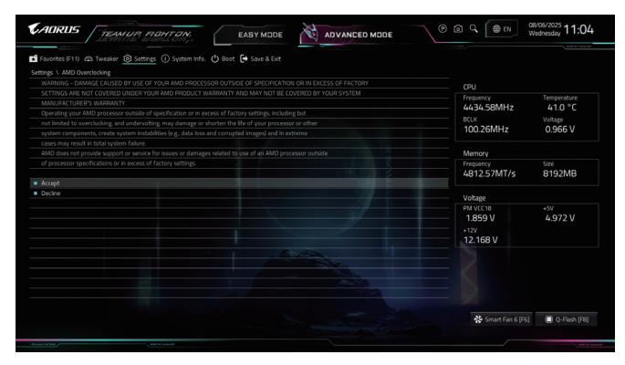

This sub-menu provides AMD overclocking-related configuration options.

## **PC Health**

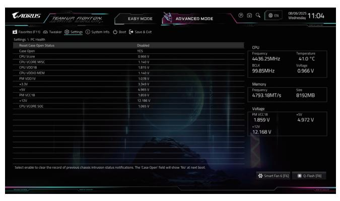

#### & **Reset Case Open Status**

Disabled Keeps or clears the record of previous chassis intrusion status.

Enabled Clears the record of previous chassis intrusion status and the **Case Open** field will show "No" at next boot.

## & **Case Open**

Displays the detection status of the chassis intrusion detection device attached to the motherboard CI header. If the system chassis cover is removed, this field will show "Yes", otherwise it will show "No". To clear the chassis intrusion status record, set **Reset Case Open Status** to **Enabled**, save the settings to the CMOS, and then restart your system.

## & **CPU Vcore/CPU VCORE MISC/CPU VDD18/CPU VDDIO MEM/PM VDD1V/+3.3V/+5V/PM VCC18/+12V/CPU VCORE SOC**

Displays the current system voltages.

## **System Info.**

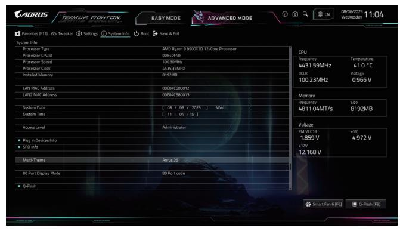

This section provides information on your motherboard model and BIOS version. You can also select the default language used by the BIOS and manually set the system time.

## & **System Language**

Selects the default language used by the BIOS.

## & **System Date**

Sets the system date. The date format is week (read-only), month, date, and year. Use <Enter> to switch between the Month, Date, and Year fields and use the <Page Up> or <Page Down> key to set the desired value.

## & **System Time**

Sets the system time. The time format is hour, minute, and second. For example, 1 p.m. is 13:00:00. Use <Enter> to switch between the Hour, Minute, and Second fields and use the <Page Up> or <Page Down> key to set the desired value.

## & **Access Level**

Displays the current access level depending on the type of password protection used. (If no password is set, the default will display as **Administrator**.) The Administrator level allows you to make changes to all BIOS settings; the User level only allows you to make changes to certain BIOS settings but not all.

#### **Plug in Devices Info**

Displays information on your PCI Express and M.2 devices if installed.

## **SPD Info**

Displays information on the installed memory.

## **Multi-Theme**

Allows you to choose different BIOS interface styles.

#### **80 Port Display Mode**

Allows you to select the type of information shown by the motherboard debug LED after the operating system has booted. Please note that during the Power-On Self-Test (POST) and before entering the operating system, the debug LED will still display 80 Port debug codes.

## **Q-Flash**

Allows you to access the Q-Flash utility to update the BIOS or back up the current BIOS configuration.

## **Boot**

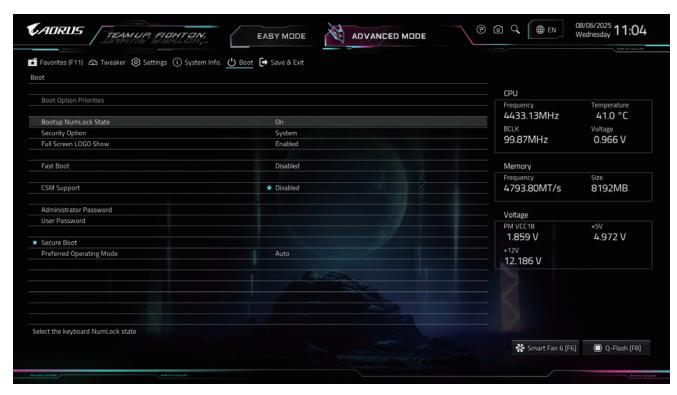

## & **Boot Option Priorities**

Specifies the overall boot order from the available devices. Removable storage devices that support GPT format will be prefixed with "UEFI:" string on the boot device list. To boot from an operating system that supports GPT partitioning, select the device prefixed with "UEFI:" string.

Or if you want to install an operating system that supports GPT partitioning such as Windows 11 64-bit, select the optical drive that contains the Windows 11 64-bit installation disk and is prefixed with "UEFI:" string.

#### & **Bootup NumLock State**

Enables or disables Numlock feature on the numeric keypad of the keyboard after the POST.

## & **Security Option**

Specifies whether a password is required every time the system boots, or only when you enter BIOS Setup. After configuring this item, set the password(s) under the **Administrator Password/User Password** item.

Setup A password is only required for entering the BIOS Setup program.

System A password is required for booting the system and for entering the BIOS Setup program.

#### & **Full Screen LOGO Show**

Allows you to determine whether to display the GIGABYTE Logo at system startup. **Disabled** skips the GIGABYTE Logo when the system starts up.

## & **Fast Boot**

Enables or disables Fast Boot to shorten the OS boot process.

#### & **SATA Support**

Last Boot SATA Devices Only Except for the previous boot drive, all SATA devices are disabled before the OS boot process completes.

All SATA Devices All SATA devices are functional in the operating system and during

the POST.

This item is configurable only when **Fast Boot** is set to **Enabled**.

#### & **NVMe Support**

Allows you to enable or disable NVMe device(s).

This item is configurable only when **Fast Boot** is set to **Enabled**.

## & **VGA Support**

Allows you to select which type of operating system to boot. Auto Enables Legacy Option ROM only.

EFI Driver Enables EFI option ROM.

This item is configurable only when **Fast Boot** is set to **Enabled**.

## & **USB Support**

Disabled All USB devices are disabled before the OS boot process completes. Full Initial All USB devices are functional in the operating system and during the POST. Partial Initial Part of the USB devices are disabled before the OS boot process completes.

This item is configurable only when **Fast Boot** is set to **Enabled**.

## & **NetWork Stack Driver Support**

Disabled Disables booting from the network. Enabled Enables booting from the network. This item is configurable only when **Fast Boot** is set to **Enabled**.

## & **CSM Support**

Enables or disables UEFI CSM (Compatibility Support Module) to support a legacy PC boot process.

Disabled Disables UEFI CSM and supports UEFI BIOS boot process only.

Enabled Enables UEFI CSM.

#### & **LAN PXE Boot Option ROM**

Allows you to select whether to enable the legacy option ROM for the LAN controller.

This item is configurable only when **CSM Support** is set to **Enabled**.

#### & **Storage Boot Option Control**

Allows you to select whether to enable the UEFI or legacy option ROM for the storage device controller.

Disabled Disables Option ROM.

UEFI Only Enables UEFI Option ROM only. Legacy Only Enables Legacy Option ROM only.

This item is configurable only when **CSM Support** is set to **Enabled**.

#### & **Other PCI Device ROM Priority**

Allows you to select whether to enable the UEFI or Legacy option ROM for the PCI device controller other than the LAN, storage device, and graphics controllers.

Disabled Disables Option ROM.

UEFI Only Enables UEFI Option ROM only. Legacy Only Enables Legacy Option ROM only.

This item is configurable only when **CSM Support** is set to **Enabled**.

#### & **Administrator Password**

Allows you to configure an administrator password. Press <Enter> on this item, type the password, and then press <Enter>. You will be requested to confirm the password. Type the password again and press <Enter>. You must enter the administrator password (or user password) at system startup and when entering BIOS Setup. Differing from the user password, the administrator password allows you to make changes to all BIOS settings.

## & **User Password**

Allows you to configure a user password. Press <Enter> on this item, type the password, and then press <Enter>. You will be requested to confirm the password. Type the password again and press <Enter>. You must enter the administrator password (or user password) at system startup and when entering BIOS Setup. However, the user password only allows you to make changes to certain BIOS settings but not all. To cancel the password, press <Enter> on the password item and when requested for the password, enter the correct one first. When prompted for a new password, press <Enter> without entering any password. Press <Enter> again when prompted to confirm.

NOTE: Before setting the User Password, be sure to set the Administrator Password first.

## **Secure Boot**

Allows you to enable or disable Secure Boot and configure related settings. This item is configurable only when **CSM Support** is set to **Disabled**.

#### & **Preferred Operating Mode**

Allows you to select whether to enter Easy mode or Advanced mode after entering BIOS Setup. **Auto** enters the BIOS mode where it was last time.

## **Save & Exit**

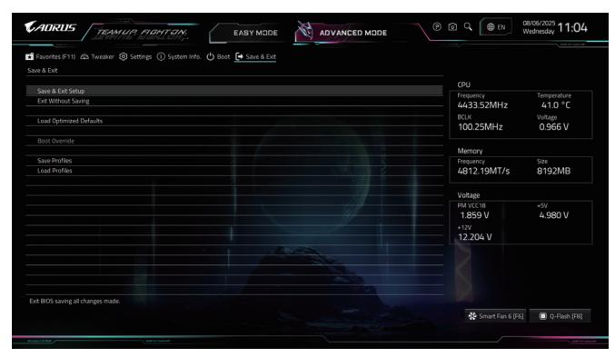

## & **Save & Exit Setup**

Press <Enter> on this item and select **Yes**. This saves the changes to the CMOS and exits the BIOS Setup program. Select **No** or press <Esc> to return to the BIOS Setup Main Menu.

## & **Exit Without Saving**

Press <Enter> on this item and select **Yes**. This exits the BIOS Setup without saving the changes made in BIOS Setup to the CMOS. Select **No** or press <Esc> to return to the BIOS Setup Main Menu.

## & **Load Optimized Defaults**

Press <Enter> on this item and select **Yes** to load the BIOS factory default settings. The BIOS defaults settings help the system to operate in optimum state. Always load the Optimized defaults after updating the BIOS or after clearing the CMOS values.

## & **Boot Override**

Allows you to select a device to boot immediately. Press <Enter> on the device you select and select **Yes** to confirm. Your system will restart automatically and boot from that device.

#### & **Save Profiles**

This function allows you to save the current BIOS settings to a profile. You can create up to 8 profiles and save as Setup Profile 1~ Setup Profile 8. Press <Enter> to complete. Or you can select **Select File in HDD/FDD/USB** to save the profile to your storage device.

## & **Load Profiles**

If your system becomes unstable and you have loaded the BIOS default settings, you can use this function to load the BIOS settings from a profile created before, without the hassles of reconfiguring the BIOS settings. First select the profile you wish to load and then press <Enter> to complete. You can select **Select File in HDD/FDD/USB** to input the profile previously created from your storage device or load the profile automatically created by the BIOS, such as reverting the BIOS settings to the last settings that worked properly (last known good record).