# **Unique Features (AMD 800 Series)**

| <b>GIGABYTE</b> | E Control Center                           | 2 |
|-----------------|--------------------------------------------|---|
|                 | RGB Fusion                                 |   |
|                 | FAN Control                                |   |
| 1-3             | Performance                                | 6 |
| 1-4             | Smart Backup                               | 7 |
|                 |                                            |   |
| BIOS Upda       | ate Utilities                              | 9 |
| 2-1             | Updating the BIOS with the Q-Flash Utility | g |
| 2-2             | Using Q-Flash Plus                         |   |

# **GIGABYTE Control Center**

GIGABYTE Control Center (GCC) gives you easy access to a wealth of GIGABYTE apps that help you get the most from your GIGABYTE motherboard (Note). Using a simple, unified user interface, GCC allows you to easily launch all GIGABYTE apps installed on your system, check related updates online, and download the apps, drivers, and BIOS.

# **Drivers Installation**

After you install the operating system, a dialog box will appear on the bottom-right corner of the desktop asking if you want to download and install the drivers and GIGABYTE applications via GIGABYTE Control Center (GCC). Click **Install** to proceed with the installation. (In BIOS Setup, make sure **Settings\IO Ports\Gigabyte Utilities Downloader Configuration\Gigabyte Utilities Downloader** is set to **Enabled**.)

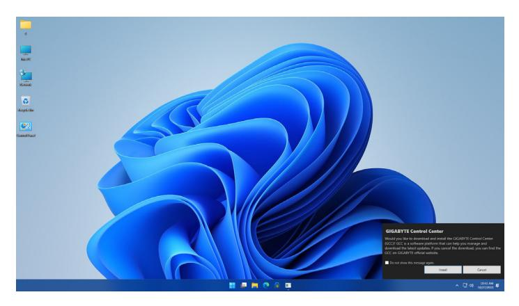

When the EULA (End User License Agreement) dialog box appears, press <Accept> to install GIGABYTE Control Center (GCC). On the GIGABYTE CONTROL CENTER screen, select the drivers and applications you want to install and click **Install**.

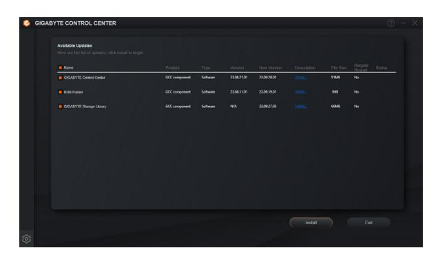

Before the installation, make sure the system is connected to the Internet.

(Note) Available applications in GIGABYTE Control Center may differ by motherboard model. Supported functions of each application may also vary depending on motherboard specifications.

# **Running the GIGABYTE Control Center**

In Desktop mode, click the GCC icon in the notification area to launch the GIGABYTE Control Center utility (Figure 1). On the main menu, you can select an app to run or click the Update center icon to update an app online.

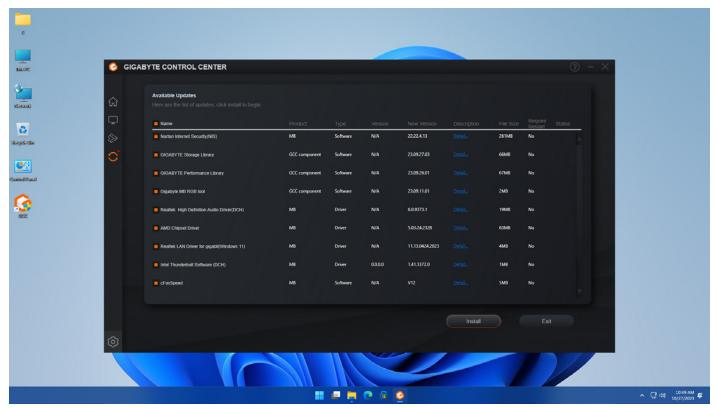

Figure 1

If the GIGABYTE Control Center is closed, you can restart it by clicking the GIGABYTE Control Center icon in All apps in the Start menu (Figure 2).

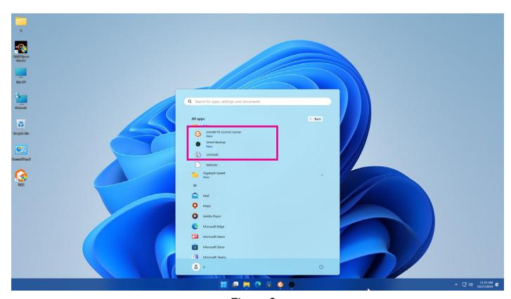

Figure 2

# **1-1 RGB Fusion**

This application allows you to enable or specify the lighting mode of the onboard LEDs while in the Windows environment. (Note 1)

#### **The RGB Fusion Interface**

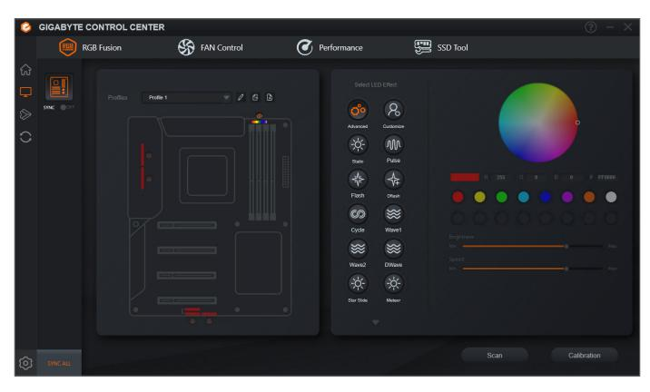

## **Using RGB Fusion**

- )To configure the options for controlling the LEDs on the motherboard, RGB LED and addressable LED strip, click the motherboard icon for further settings. (Note 2) Select your desired area and select the LED color/ lighting behaviour on the right section of the screen.
- )When selecting an addressable LED strip, click **Scan** to detect the type of light strip you have installed. RGB Fusion will automatically display various digital modes for the addressable LED strip.
- )If you have installed an addressable RGB Gen2 LED strip, the **Advanced** mode allows you to configure an individual LED or LED strip.

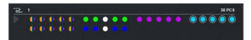

Example of an addressable RGB Gen2 LED strip display

- To avoid abnormal LED behavior, do not connect addressable RGB Gen1 LED strips and addressable RGB Gen2 LED strips to the same header at the same time.
- The maximum number of addressable RGB Gen2 LEDs supported is 256; the maximum number of LED strips supported is 8.
- The number of LEDs or LED strips that can be displayed may vary depending on the specifications of each specific type of LED strip.
- (Note 1) RGB Fusion will automatically search for the devices that have LED lighting feature and display them on the list.
- (Note 2) Regions/Modes/Colors available may vary by motherboard.

# **1-2 FAN Control**

This application allows you to monitor and adjust the fan speed in the operating system.

#### **The FAN Control Interface**

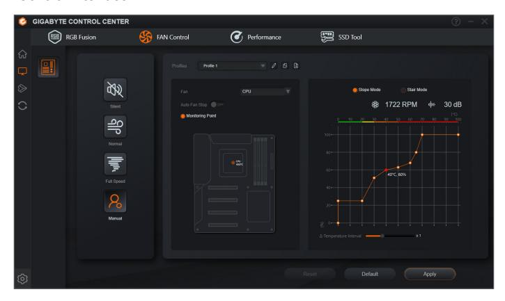

## **Using FAN Control**

- )The application allows you to specify a Smart Fan mode.
- )The **Manual** mode allows you to adjust the smart fan speed. The fans will run at different speeds according to system temperatures. The **Reset** button can revert the fan settings back to the last saved values.
  - **Noise Detection** provides detection of the noise level (measured in decibels) inside the chassis.

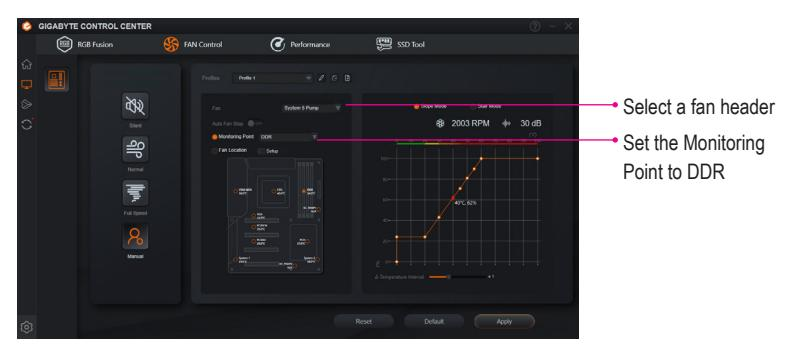

)If the motherboard accessories include DDR Wind Blade, connect its fan cable to the designated fan header. In **Manual** mode, select the header and set the temperature monitoring point to **DDR**. This will allow you to adjust the fan speed of DDR Wind Blade with FAN Control.

**Note:** The DDR temperature monitoring point is available only when a memory module that supports this feature is installed. For further support information, please contact your memory vendor.

- The speed control function requires the use of a fan with fan speed control design.
- To use the noise detection function, you must have a motherboard with a noise detection header.

# **1-3 Performance**

This application is a simple and easy-to-use interface that allows users to fine-tune their system settings or do overclock/overvoltage in Windows environment.

# **The Performance Interface**

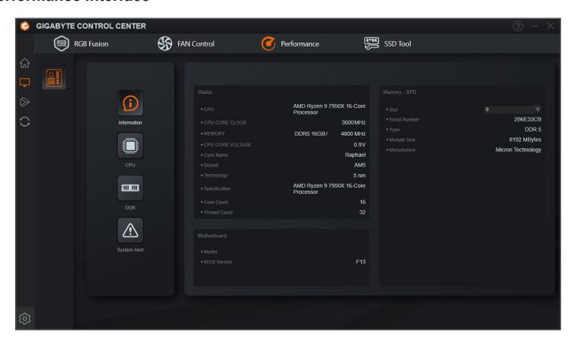

## **Using Performance**

#### )**Information**

This section provides information on your CPU, memory, motherboard model, and BIOS version.

#### )**CPU**

| Frequency | Provides you with different levels of CPU frequency to choose to achieve desired system performance.  |
|-----------|----------------------------------------------------------------------------------------------------------|
| Status    | Displays basic information on your CPU and memory, CPU core clock, and CPU core voltage.              |
| Voltage   | Allows you to adjust voltages.                                                                           |
| Power     | Allows you to configure power limit, Load-Line Calibration level, and voltage protection value level. |

After making changes, be sure to restart your system for these changes to take effect. You can save the current settings to a profile. You can create up to 2 profiles.

#### )**DDR**

Allows you to set the memory clock.

#### )**System Alert**

Allows you to monitor hardware temperature, voltage and fan speed, and set warning alarm.

Available functions in Performance may vary by motherboard model and CPU. Grayed-out area(s) indicates that the item is not configurable or the function is not supported.

Incorrectly doing overclock/overvoltage may result in damage to the hardware components such as CPU, chipset, and memory and reduce the useful life of these components. Before you do the overclock/ overvoltage, make sure that you fully know each function of Performance, or system instability or other unexpected results may occur.

# **1-4 Smart Backup**

Smart Backup allows you to back up a partition as an image file every hour. You can use these images to restore your system or files when needed.

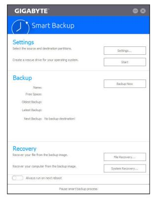

The Smart Backup main menu:

| Button        | Description                                                  |
|---------------|--------------------------------------------------------------|
| Settings      | Allows you to select the source and destination partition |
| Start         | Allows you to create a rescue drive                          |
| Backup Now    | Allows you to perform the backup immediately                 |
| File Recovery | Allows you to recover your files from the backup image    |
| System        | Allows you to recover your system from the backup            |
| Recovery      | image                                                        |

- Smart Backup only supports NTFS file system.
  - You need to select the destination partition in **Settings** the first time you use Smart Backup.
  - The **Backup Now** button will be available only after 10 minutes you have logged in Windows.
  - Select the **Always run on next reboot** checkbox to automatically enable Smart Backup after system reboot.

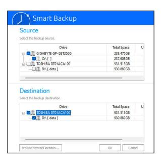

## **Creating a backup:**

Click the **Settings** button on the main menu. In the **Settings** dialog box, select the source partition and destination partition and click **OK**. The initial backup will start after 10 minutes and regular backup will be performed hourly. Note: By default, all partitions on the system drive are selected as the backup source. The backup destination cannot be on the same partition as the backup source.

## **Saving the backup to a network location:**

If you want to save the backup to a network location, select **Browse network location**. Make sure your computer and the computer where you want to save the backup are in the same domain. Choose the network location where you want to store the backup and enter the user name and password. Follow the on-screen instructions to complete.

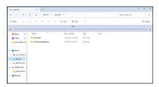

#### **Recovering a file:**

Click the **File Recovery** button on the main menu. Use the time slider on the top of the popped out window to select a previous backup time. The right pane will display the backed-up partitions in the backup destination (in the **My Backup** folder). Browse to the file you want and copy it.

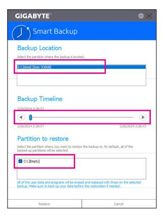

# **Recovering your system with Smart Backup:**

#### Steps:

- 1. Click the **System Recovery** button on the main menu.
- 2. Select the location where your backup is saved.
- 3. Use the time slider to select a time point.
- 4. Select a partition backup created on the selected time point and click **Restore**.
- 5. Confirm whether to restart your system to proceed with the restore immediately or later. Once you respond "Yes" the system will restart to the Windows recovery environment. Follow the onscreen instructions to restore your system.

All of your files and programs will be deleted and replaced with those on the selected backup. If needed, be sure to make a copy of your data before the restore.

# **BIOS Update Utilities**

GIGABYTE motherboards provide two unique BIOS update tools, Q-Flash™ and Q-Flash Plus. Either one allows you to update the BIOS without the need to enter MS-DOS mode. Additionally, the Q-Flash Plus feature can provide multiple protection multiple protection for the safety and stability of your computer.

#### **What is Q-Flash Plus?**

Q-Flash Plus allows you to update the BIOS when your system is off (S5 shutdown state). Save the latest BIOS on a USB thumb drive and plug it into the dedicated port, and then you can now flash the BIOS automatically by simply pressing the Q-Flash Plus button.

#### **What is Q-Flash™?**

With Q-Flash you can update the system BIOS without having to enter operating systems like MS-DOS or Window first. Embedded in the BIOS, the Q-Flash tool frees you from the hassles of going through complicated BIOS flashing process.

# **2-1 Updating the BIOS with the Q-Flash Utility**

# **A. Before You Begin**

- 1. From GIGABYTE's website, download the latest compressed BIOS update file that matches your motherboard model.
- 2. Extract the file and save the new BIOS file (e.g. X870EAORUSMASTER.F1) to your USB flash drive, or hard drive. (Note: The USB flash drive or hard drive must use FAT32/16 file system.)
- 3. Restart the system. During the POST, press the <End> key to enter Q-Flash. Note: You can access Q-Flash by either pressing the <End> key during the POST or click the **Q-Flash** icon (or press the <F8> key) in BIOS Setup. However, if the BIOS update file is saved to a hard drive in RAID/AHCI mode or a hard drive attached to an independent SATA controller, use the <End> key during the POST to access Q-Flash.

Because BIOS flashing is potentially risky, please do it with caution. Inadequate BIOS flashing may result in system malfunction.

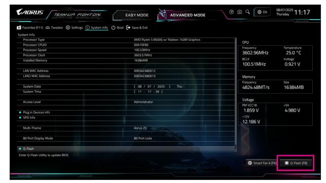

Click **Q-Flash (F8)** or select the Q-Flash item on the System Info. menu to access Q-Flash.

## **B. Updating the BIOS**

In the main menu of Q-Flash, use the keyboard or mouse to select an item to execute. When updating the BIOS, choose the location where the BIOS file is saved. The following procedure assumes that you save the BIOS file to a USB flash drive.

#### Step 1:

1. Insert the USB flash drive containing the BIOS file into the computer. In the main screen of Q-Flash, select **Update BIOS**.

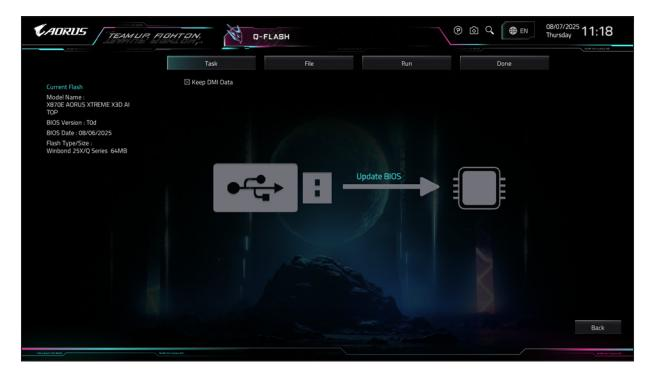

- Q-Flash only supports USB flash drive or hard drives using FAT32/16 file system. • If the BIOS update file is saved to a hard drive in RAID/AHCI mode or a hard drive attached to an independent SATA controller, use the <End> key during the POST to access Q-Flash.
- 2. Select the BIOS update file.

**Make sure the BIOS update file matches your motherboard model.**

#### Step 2:

The screen will show that the BIOS file is being read from your USB flash drive and then display the current update process.

- **To ensure the integrity of the BIOS update, the system will shut down and restart automatically. Then it will begin to flash the BIOS with Q-Flash.**
- **Do not turn off or restart the system when the system is reading/updating the BIOS.**
- **Do not remove the USB flash drive or hard drive when the system is updating the BIOS.**

#### Step 3:

The system will restart after the update process is complete.

## Step 4:

During the POST, press <Delete> to enter BIOS Setup. Select **Load Optimized Defaults** on the **Save & Exit** screen and press <Enter> to load BIOS defaults. System will re-detect all peripheral devices after a BIOS update, so we recommend that you reload BIOS defaults.

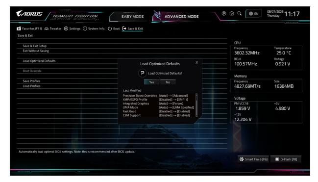

Select **Yes** to load BIOS defaults

#### Step 5:

Select **Save & Exit Setup** and press <Enter>. And then select **Yes** to save settings to CMOS and exit BIOS Setup. The procedure is complete after the system restarts.

# **2-2 Using Q-Flash Plus**

## **A. Before You Begin:**

- 1. From GIGABYTE's website, download the latest compressed BIOS update file that matches your motherboard model.
- 2. Uncompress the downloaded BIOS file, save it to your USB flash drive, and rename it to **GIGABYTE.bin**. Note: The USB flash drive must use FAT32/16/12 file system.
- 3. Connect the power cables to the 12V power connector (connect either one if there are two) and main power connector.
- 4. Please turn on the power supply before connecting the USB flash drive to the Q-Flash Plus port on the back panel.

# **B. Using Q-Flash Plus**

Press the Q-Flash Plus button and the system will automatically search for and match the BIOS file in the USB flash drive on the Q-Flash Plus port. The QFLED or the Q-Flash Plus button will flash during the BIOS matching and flashing process. Wait for 6-8 minutes and the LEDs will stop flashing when the BIOS flashing is complete.

- If you choose to update the BIOS manually, first make sure that your system is off (S5 shutdown state).
- If your motherboard has a BIOS switch and a SB switch, reset them to their default settings. (Default setting for the BIOS switch: Boot from the main BIOS; default setting for the SB switch: Dual BIOS)
- On motherboards with DualBIOS™, the DualBIOS™ feature will continue to update the backup BIOS after the main BIOS has been flashed and the system restarts. After completion, the system will reboot again and boot from the main BIOS.