# **X870E AORUS XTREME AI TOP (X870E A XTREME AI TOP)**

User's Manual

Rev. 112

GIGABYTE will reduce paper use in order to fulfill the responsibilities of a global citizen. Also, to reduce the impacts on global warming, the packaging materials of this product are recyclable and reusable. GIGABYTE works with you to protect the environment. For more product details, please visit GIGABYTE's website.

# **Copyright**

© 2025 GIGA-BYTE TECHNOLOGY CO., LTD. All rights reserved.

The trademarks mentioned in this manual are legally registered to their respective owners.

# **Disclaimer**

Information in this manual is protected by copyright laws and is the property of GIGABYTE. Changes to the specifications and features in this manual may be made by GIGABYTE without prior notice. No part of this manual may be reproduced, copied, translated, transmitted, or published in any form or by any means without GIGABYTE's prior written permission.

- For detailed product information, carefully read the User's Manual.
- For quick set-up of the product, refer to the Quick Installation Guide on GIGABYTE's website.

https://download.gigabyte.com/FileList/Manual/mb\_manual\_installation-guide\_800series.pdf

For product-related information, check on our website at: https://www.gigabyte.com

# **Identifying Your Motherboard Revision**

The revision number on your motherboard looks like this: "REV: X.X." For example, "REV: 1.0" means the revision of the motherboard is 1.0. Check your motherboard revision before updating motherboard BIOS, drivers, or when looking for technical information.

# Example:

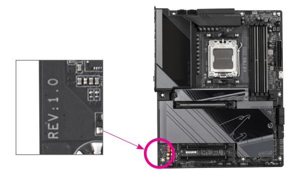

# **Table of Contents**

| Chapter 1 | Prod  | uct Introduction                                      | 4  |
|-----------|-------|-------------------------------------------------------|----|
|           | 1-1   | Motherboard Layout                                    | 4  |
|           | 1-2   | Motherboard Block Diagram                             | 5  |
|           | 1-3   | Box Contents                                          | 6  |
| Chapter 2 | Hard  | ware Installation                                     | 7  |
|           | 2-1   | Installation Precautions                              | 7  |
|           | 2-2   | Product Specifications                                | 8  |
|           | 2-3   | Installing the CPU and CPU Cooler                     | 12 |
|           | 2-4   | Installing the Memory                                 | 15 |
|           | 2-5   | Installing an Expansion Card                          | 17 |
|           | 2-6   | Back Panel Connectors                                 | 18 |
|           | 2-7   | Onboard Buttons, Voltage Measurement Points, and LEDs | 20 |
|           | 2-8   | Internal Connectors                                   | 22 |
| Chapter 3 | BIOS  | S Setup                                               | 36 |
| Chapter 4 | Insta | lling the Operating System and Drivers                | 38 |
|           | 4-1   | Operating System Installation                         | 38 |
|           | 4-2   | Drivers Installation                                  | 39 |
| Chapter 5 | Appe  | endix                                                 | 40 |
|           | 5-1   | Configuring a RAID Set                                | 40 |
|           | 5-2   | Debug LED Codes                                       | 41 |
|           | Regu  | latory Notices                                        | 45 |
|           | Conta | act Us                                                | 48 |

# **Chapter 1 Product Introduction**

# **1-1 Motherboard Layout**

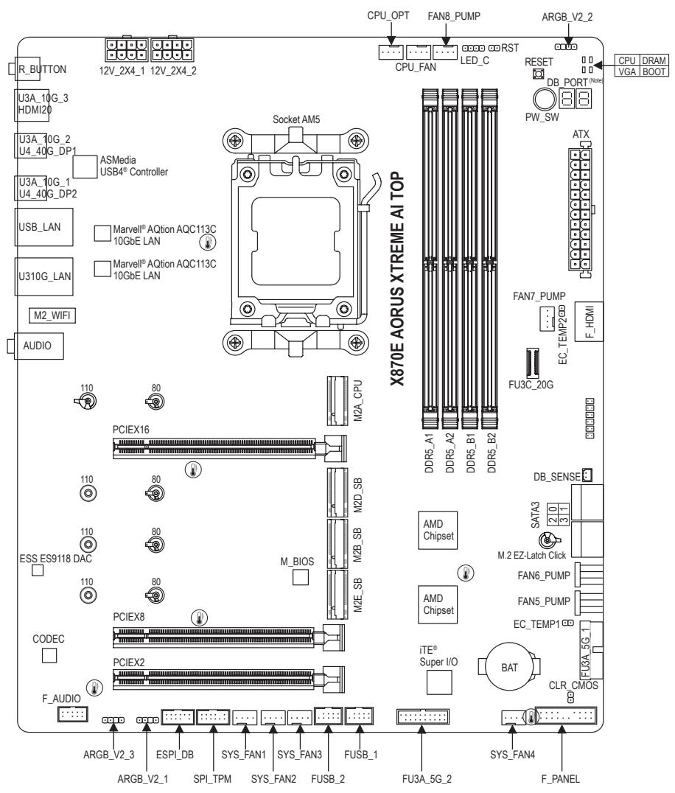

Temperature sensor

Be sure not to put pressure on the surface of the LCD panel of the rear I/O armor. Otherwise, damage to the LCD panel may occur.

(Note) For debug code information, please refer to the "Debug LED Codes" pages.

# **1-2 Motherboard Block Diagram**

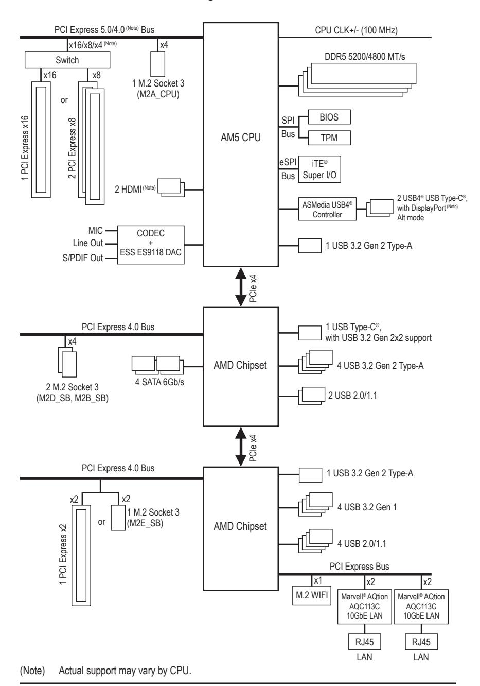

# **1-3 Box Contents**

- X870E AORUS XTREME AI TOP motherboard
- User's Manual
- Quick Installation Guide
- One antenna
- DDR Wind Blade
- Two SATA cables
- One noise detection cable
- Two thermistor cables
- One G Connector
- Two Velcro cable ties
- One ESSential USB DAC
- Four M.2 thermal pads

\* The box contents above are for reference only and the actual items shall depend on the product package you obtain. The box contents are subject to change without notice.

# **Chapter 2 Hardware Installation**

# **2-1 Installation Precautions**

The motherboard contains numerous delicate electronic circuits and components which can become damaged as a result of electrostatic discharge (ESD). Prior to installation, carefully read the user's manual and follow these procedures:

- **•** Prior to installation, make sure the chassis is suitable for the motherboard.
- **•** Prior to installation, do not remove or break motherboard S/N (Serial Number) sticker or warranty sticker provided by your dealer. These stickers are required for warranty validation.
- **•** Always remove the AC power by unplugging the power cord from the power outlet before installing or removing the motherboard or other hardware components.
- **•** When connecting hardware components to the internal connectors on the motherboard, make sure they are connected tightly and securely.
- **•** When handling the motherboard, avoid touching any metal leads or connectors.
- **•** It is best to wear an electrostatic discharge (ESD) wrist strap when handling electronic components such as a motherboard, CPU or memory. If you do not have an ESD wrist strap, keep your hands dry and first touch a metal object to eliminate static electricity.
- **•** Prior to installing the motherboard, please have it on top of an antistatic pad or within an electrostatic shielding container.
- **•** Before connecting or unplugging the power supply cable from the motherboard, make sure the power supply has been turned off.
- **•** Before turning on the power, make sure the power supply voltage has been set according to the local voltage standard.
- **•** Before using the product, please verify that all cables and power connectors of your hardware components are connected.
- **•** To prevent damage to the motherboard, do not allow screws to come in contact with the motherboard circuit or its components.
- **•** Make sure there are no leftover screws or metal components placed on the motherboard or within the computer casing.
- **•** Do not place the computer system on an uneven surface.
- **•** Do not place the computer system in a high-temperature or wet environment.
- **•** Turning on the computer power during the installation process can lead to damage to system components as well as physical harm to the user.
- **•** If you are uncertain about any installation steps or have a problem related to the use of the product, please consult a certified computer technician.
- **•** If you use an adapter, extension power cable, or power strip, ensure to consult with its installation and/or grounding instructions.

# 2-2 Product Specifications

| CPU                                 | AMD Socket AM5, support for:     AMD Ryzen™ 9000 Series Processors/     AMD Ryzen™ 8000 Series Processors/     AMD Ryzen™ 7000 Series Processors     (Go to GIGABYTE's website for the latest CPU support list.)                                                                                                                                                                                                                                                                                                                                                                                                                                                                                                                                                                                                               |
|-------------------------------------|--------------------------------------------------------------------------------------------------------------------------------------------------------------------------------------------------------------------------------------------------------------------------------------------------------------------------------------------------------------------------------------------------------------------------------------------------------------------------------------------------------------------------------------------------------------------------------------------------------------------------------------------------------------------------------------------------------------------------------------------------------------------------------------------------------------------------------|
| Chipset                             | ◆ AMD X870E                                                                                                                                                                                                                                                                                                                                                                                                                                                                                                                                                                                                                                                                                                                                                                                                                    |
| Memory                              | <ul> <li>Support for DDR5 5200/4800 MT/s memory modules</li> <li>4 x DDR5 DIMM sockets supporting up to 256 GB (64 GB single DIMM capacity) of system memory</li> <li>Dual channel memory architecture</li> <li>Support for ECC and non-ECC Un-buffered DIMM memory modules</li> <li>Support for AMD EXtended Profiles for Overclocking (AMD EXPO**) and Extreme Memory Profile (XMP) memory modules         (The CPU and memory configuration may affect the supported memory types, data rate (speed), and number of DRAM modules, please refer to "Memory Support List" on GIGABYTE's website for more information.)     </li> </ul>                                                                                                                                                                                        |
| Onboard Graphics                 | <ul> <li>Integrated Graphics Processor with AMD Radeon™ Graphics support+ASMedia USB4® Controller:         <ul> <li>2 x USB4® USB Type-C® ports, supporting USB4 and DisplayPort video outputs and a maximum resolution of 3840x2160@240 Hz</li> <li>* Support for DisplayPort 1.4 version and HDR.</li> </ul> </li> <li>Integrated Graphics Processor with AMD Radeon™ Graphics support:         <ul> <li>1 x HDMI port, supporting a maximum resolution of 4096x2160@60 Hz</li> <li>* Support for HDMI 2.1 version, HDCP 2.3, and HDR.</li> <li>** Support for native HDMI 2.1 TMDS compatible ports.</li> <li>1 x Front HDMI port, supporting a maximum resolution of 1920x1080@30 Hz</li> <li>* Support for HDMI 1.4 version.</li> </ul> </li> <li>(Graphics specifications may vary depending on CPU support.)</li> </ul> |
| Audio                               | Realtek® ALC1220 CODEC  * The front panel line out jack supports DSD audio.  ESS ES9118 DAC chip  Support for DTS:X® Ultra  High Definition Audio  2/4/5.1-channel  * You can change the functionality of an audio jack using the audio software. To configure 5.1-channel audio, access the audio software for audio settings.  Support for S/PDIF Out                                                                                                                                                                                                                                                                                                                                                                                                                                                                        |
| ELAN LAN                            | 2 x Marvell® AQtion AQC113C 10GbE LAN chips     (10 Gbps/5 Gbps/2.5 Gbps/1 Gbps/100 Mbps)                                                                                                                                                                                                                                                                                                                                                                                                                                                                                                                                                                                                                                                                                                                                      |
| Wireless Communication Module | Qualcomm® Wi-Fi 7 QCNCM865 (PCB rev. 1.0)  802.11a, b, g, n, ac, ax, be, supporting 2.4/5/6 GHz carrier frequency bands  BLUETOOTH 5.4  Support for 11be 320MHz wireless standard (Actual data rate may vary depending on environment and equipment.)  * Wi-Fi 7 features require Windows 11 SV3 to function properly. (There is no support driver for Windows 10.)  ** Wi-Fi 7 channels on 6 GHz band availability depends on individual country's regulations.  ***Bluetooth version may change with updates. See the Wi-Fi chip vendor's website for details.                                                                                                                                                                                                                                                               |

- Wireless
  Communication
  Module

  Expansion Slots
  - MediaTek Wi-Fi 7 MT7927, RZ738 (PCB rev. 1.1)
    - 802.11a, b, g, n, ac, ax, be, supporting 2.4/5/6 GHz carrier frequency bands
    - BLUETOOTH 5.4
    - Support for 11be 320MHz wireless standard

(Actual data rate may vary depending on environment and equipment.)

- \* Wi-Fi 7 features require Windows 11 SV3 to function properly. (There is no support driver for Windows 10)
- \*\* Wi-F17 channels on 6 GHz band availability depends on individual country's regulations.
- \*\*\* Bluetooth version may change with updates. See the Wi-Fi chip vendor's website for details.

# pansion Slots • 1 x PCI Express x16 slot (PCIEX16), integrated in the CPU:

- Note: The second Processor of the AMD Ryzen 9000/7000 Series Processors support PCle 5.0 x16 mode
- ► AMD Ryzen™ 8000 Series-Phoenix 1 Processors support PCle 4.0 x8 mode
- ► AMD Ryzen™ 8000 Series-Phoenix 2 Processors support PCle 4.0 x4 mode
  - \* The PCIEX8 slot shares bandwidth with the PCIEX16 slot. When the PCIEX8 slot is
    - \* The PCIEX16 and PCIEX8 slots can only support a graphics card or an NVMe SSD. If only one graphics card is to be installed, be sure to install it in the PCIEX16 slot.
- 1 x PCI Express x16 slot (PCIEX8), integrated in the CPU:

populated, the PCIEX16 slot operates at up to x8 mode.

- ► AMD Ryzen™ 9000/7000 Series Processors support PCle 5.0 x8 mode
  - \* The PCIEX8 slot becomes unavailable when an AMD Ryzen™ 8000 Series-Phoenix 1/ Phoenix 2 processor is used.
- Chipset:
  - 1 x PCI Express x16 slot, supporting PCIe 4.0 and running at x2 (PCIEX2)
    - \* The PCIEX2 slot shares bandwidth with the M2E\_SB connector. The PCIEX2 slot becomes unavailable when a device is installed in the M2E\_SB connector.

# Storage Interface •

- 1 x M.2 connector (M2A\_CPU), integrated in the CPU, supporting Socket 3, M key, type 25110/22110/2580/2280 SSDs:
- MD Ryzen™ 9000/7000 Series Processors support PCle 5.0 x4/x2 SSDs
- ► AMD Ryzen™ 8000 Series-Phoenix 1 Processors support PCIe 4.0 x4/x2 SSDs
- ► AMD Ryzen™ 8000 Series-Phoenix 2 Processors support PCle 4.0 x4/x2 SSDs
- 2 x M.2 connectors (M2D\_SB, M2B\_SB), integrated in the Chipset, supporting
- Socket 3, M key, type 22110/2280 PCIe 4.0 x4/x2 SSDs
   1 x M.2 connector (M2E\_SB), integrated in the Chipset, supporting Socket 3, M key, type 22110/2280 PCIe 4.0 x2 SSDs
  - 4 x SATA 6Gb/s connectors
- RAID 0, RAID 1, RAID 5, and RAID 10 support for NVMe SSD storage devices
   \* RAID 5 is only available on AMD Ryzen™ 9000 Series Processors.
  - RAID 0, RAID 1, and RAID 10 support for SATA storage devices

# **USB**

- CPU+ASMedia USB4® controller:
  - 2 x USB4® USB Type-C® ports on the back panel
- CPU:
  - 1 x USB 3.2 Gen 2 Type-A port (red) on the back panel
- Chipset:
  - 1 x USB Type-C® port with USB 3.2 Gen 2x2 support, available through the internal USB header
  - 5 x USB 3.2 Gen 2 Type-A ports (red) on the back panel
  - 4 x USB 3.2 Gen 1 ports available through the internal USB headers
  - 6 x USB 2.0/1.1 ports (2 ports on the back panel, 4 ports available through the internal USB headers)

| Internal Š 1 x 24-pin ATX main power connector Š Connectors 2 x 8-pin ATX 12V power connectors Š 1 x CPU fan header Š 1 x CPU fan/water cooling pump header |       |
|----------------------------------------------------------------------------------------------------------------------------------------------------------------------------------------------------------------------------------------------------------|-------|
|                                                                                                                                                                                                                                                          |       |
|                                                                                                                                                                                                                                                          |       |
|                                                                                                                                                                                                                                                          |       |
| Š 4 x system fan headers                                                                                                                                                                                                                  |       |
| Š 4 x system fan/water cooling pump headers                                                                                                                                                                                         |       |
| Š 3 x addressable RGB Gen2 LED strip headers                                                                                                                                                                                     |       |
| Š 1 x RGB LED strip header                                                                                                                                                                                                             |       |
| Š 4 x SATA 6Gb/s connectors                                                                                                                                                                                                               |       |
| Š 4 x M.2 Socket 3 connectors                                                                                                                                                                                                          |       |
| Š 2 x temperature sensor headers                                                                                                                                                                                                          |       |
| Š 1 x front panel header                                                                                                                                                                                                                  |       |
| Š 1 x front panel audio header                                                                                                                                                                                                         |       |
| Š Type-C® header, 1 x USB with USB 3.2 Gen 2x2 support Š 2 x USB 3.2 Gen 1 headers                                                                                                                 |       |
| Š 2 x USB 2.0/1.1 headers                                                                                                                                                                                                                 |       |
| Š 1 x noise detection header                                                                                                                                                                                                              |       |
| Š 1 x HDMI port (Note)                                                                                                                                                                                                                    |       |
| Š 1 x Trusted Platform Module header (For the GC-TPM2.0 SPI V2 module                                                                                                                                                | only) |
| Š 1 x power button                                                                                                                                                                                                                           |       |
| Š 1 x reset button                                                                                                                                                                                                                           |       |
| Š 1 x reset jumper                                                                                                                                                                                                                           |       |
| Š 1 x Clear CMOS jumper                                                                                                                                                                                                                   |       |
| Š Voltage Measurement Points                                                                                                                                                                                                                    |       |
| Š Back Panel 1 x Q-Flash Plus button                                                                                                                                                                                                |       |
| Š Connectors 1 x Clear CMOS button                                                                                                                                                                                                     |       |
| Š 1 x HDMI port (Note)                                                                                                                                                                                                                    |       |
| Š USB4® USB Type-C® ports (Note) 2 x (DisplayPorts )                                                                                                                                                                                |       |
| Š 6 x USB 3.2 Gen 2 Type-A ports (red)                                                                                                                                                                                        |       |
| Š 2 x USB 2.0/1.1 ports                                                                                                                                                                                                                   |       |
| Š 2 x RJ-45 ports                                                                                                                                                                                                                            |       |
| Š 2 x antenna connectors (2T2R)                                                                                                                                                                                                           |       |
| Š 1 x optical S/PDIF Out connector                                                                                                                                                                                                     |       |
| Š 2 x audio jacks                                                                                                                                                                                                                            |       |
| I/O Controller Š iTE® I/O Controller Chip                                                                                                                                                                                                 |       |
| Š Hardware Voltage detection                                                                                                                                                                                                                    |       |
| Monitor Š Temperature detection                                                                                                                                                                                                                 |       |
| Š Fan speed detection                                                                                                                                                                                                                           |       |
| Š Water cooling flow rate detection                                                                                                                                                                                                       |       |
| Š Fan fail warning                                                                                                                                                                                                                              |       |
| Š Fan speed control                                                                                                                                                                                                                             |       |
| * Whether the fan speed control function is supported will depend on the fan you install.                                                                                                                                                                |       |
| Š Noise detection                                                                                                                                                                                                                                  |       |

(Note) Actual support may vary by CPU.

| BIOS               | Š 1 x 256 Mbit flash                                                  |
|--------------------|--------------------------------------------------------------------------------------|
|                    | Š Use of licensed AMI UEFI BIOS                                    |
|                    | Š PnP 1.0a, DMI 2.7, WfM 2.0, SM BIOS 2.7, ACPI 5.0 |
| Unique Features | Š Support for GIGABYTE Control Center (GCC)                        |
|                    | * Available applications in GCC may vary by motherboard model. Supported functions   |
|                    | of each application may also vary depending on motherboard specifications.           |
|                    | Š Support for Q-Flash                                                       |
|                    | Š Support for Q-Flash Plus                                               |
|                    | Š Support for Smart Backup                                               |
| Bundled            | Š Norton® Internet Security (OEM version)                                |
| Software           | Š LAN bandwidth management software                                      |
|                    | * Service discontinued as a result of contract termination by the software provider. |
| Operating          | Š Support for Windows 11 64-bit                                                   |
| System             | (Go to GIGABYTE's website for operating system support information.)                 |
| Form Factor     | Š E-ATX Form Factor; 30.5cm x 26.9cm                               |

\* GIGABYTE reserves the right to make any changes to the product specifications and product-related information without prior notice.

https://www.gigabyte.com/Support/Utility/Motherboard?m=ut

&amp; Please visit the **SERVICE/SUPPORT\Utility** page on GIGABYTE's website to download the latest version of apps.

# **2-3 Installing the CPU and CPU Cooler**

Read the following guidelines before you begin to install the CPU:

- Make sure that the motherboard supports the CPU. (Go to GIGABYTE's website for the latest CPU support list.)
- Always turn off the computer and unplug the power cord from the power outlet before installing the CPU to prevent hardware damage.
- Locate the pin one of the CPU. The CPU cannot be inserted if oriented incorrectly. (Or you may locate the notches on both sides of the CPU and alignment keys on the CPU socket.)
- Apply an even and thin layer of thermal grease on the surface of the CPU.
- Do not turn on the computer if the CPU cooler is not installed, otherwise overheating and damage of the CPU may occur.
- Set the CPU host frequency in accordance with the CPU specifications. It is not recommended that the system bus frequency be set beyond hardware specifications since it does not meet the standard requirements for the peripherals. If you wish to set the frequency beyond the standard specifications, please do so according to your hardware specifications including the CPU, graphics card, memory, hard drive, etc.

# **A. Note the CPU Orientation**

Note the alignment keys on the motherboard CPU socket and the notches on the CPU.

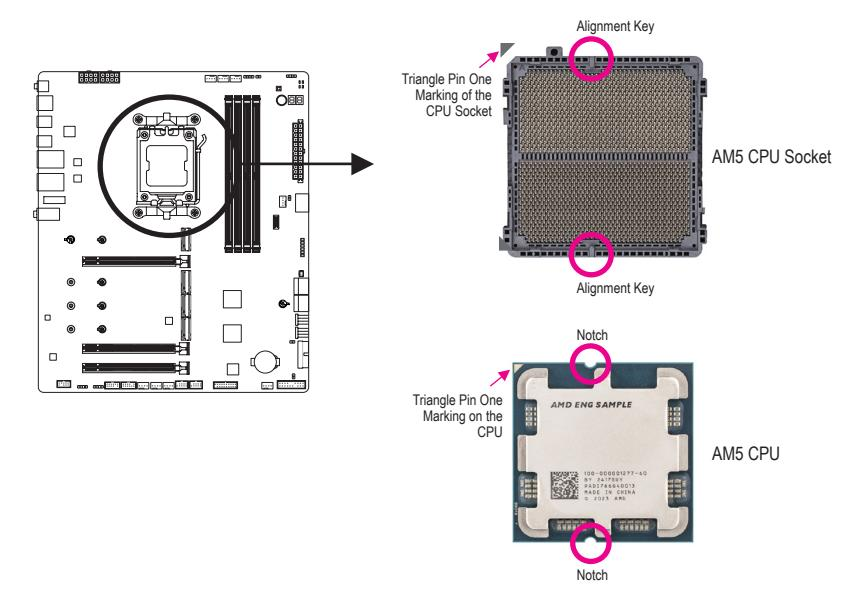

**Do not remove the CPU socket cover before inserting the CPU. It may pop off from the load plate automatically after you insert the CPU and close the load plate.**

& Please visit GIGABYTE's website for details on hardware installation. https://www.gigabyte.com/WebPage/210/quick-guide.html?m=sw

# B. Installing the CPU

Follow the steps below to correctly install the CPU into the motherboard CPU socket.

- ① Gently press the CPU socket lever handle down and away from the socket.
- ②Completely lift up the CPU socket locking lever.
- ③With your fingers, hold the plastic protective cover attached to the metal load plate to lift open the metal load plate.

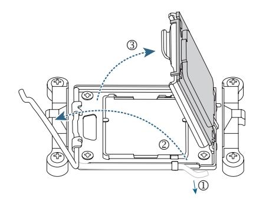

Hold the CPU with your fingers by the edges. Align the CPU pin one marking (triangle) with the pin one corner of the CPU socket (or you may align the CPU notches with the socket alignment keys) and gently insert the CPU into position.

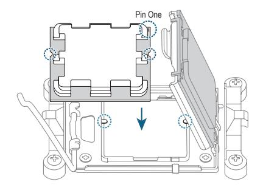

Make sure the CPU is properly installed and then close the load plate. Secure the socket lever under its retention tab. The plastic protective cover will pop off by itself and can be removed.

\* Always replace the plastic protective cover when the CPU is not installed to protect the CPU socket.

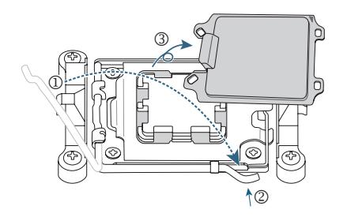

Do not force to engage the CPU socket locking lever when the CPU is not installed correctly as this would damage the CPU and CPU socket.

# **C. Installing the CPU Cooler**

Be sure to install the CPU cooler after installing the CPU. (Actual installation process may differ depending the CPU cooler to be used. Refer to the user's manual for your CPU cooler.)

Apply an even and thin layer of thermal grease on the surface of the installed CPU.

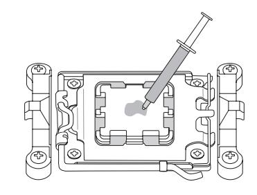

#### Type A:

Hook the CPU cooler clip to the mounting lug on one side of the retention frame. On the other side, push straight down on the CPU cooler clip to hook it to the mounting lug on the retention frame. Turn the cam handle from the left side to the right side to lock into place.

#### Type B:

First remove the four screws from the CPU retention frame and remove the CPU retention frame. Then align the four shoulder screws on the CPU cooler with the standoffs from the back plate. Fasten each shoulder screw in a 1-2-3-4 (x) pattern as shown on the right.

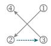

\* When using a Type B CPU cooler, it is not recommended to fasten each screw down all the way in one step. Follow order 1-2-3-4, fasten screw clockwise 1 rotation per step. Repeat steps 1-2-3-4 till all screws are fastened.

Finally, attach the power connector of the CPU cooler to the CPU fan header (CPU\_FAN) on the motherboard.

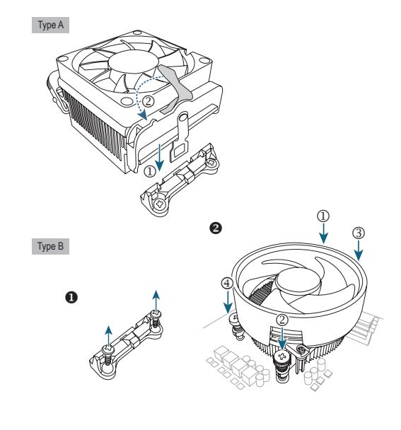

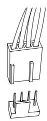

CPU\_FAN 4 1

# **2-4 Installing the Memory**

Read the following guidelines before you begin to install the memory:

- Make sure that the motherboard supports the memory. It is recommended that memory of the same capacity, brand, speed, and chips be used. (Go to GIGABYTE's website for the latest supported memory speeds and memory modules.)
- Always turn off the computer and unplug the power cord from the power outlet before installing the memory to prevent hardware damage.
- Memory modules have a foolproof design. A memory module can be installed in only one direction. If you are unable to insert the memory, switch the direction.
- When installing memory modules, be sure to install in the DDR5\_A2 socket first.

#### \* Recommended Memory Configurations:

|            | DDR5_A1 | DDR5_A2 | DDR5_B1 | DDR5_B2 |
|------------|---------|---------|---------|---------|
| 1 Module   |         | a       |         |         |
| 2 Modules* |         | a       |         | a       |
| 4 Modules* | a       | a       | a       | a       |

("a"=Installed, "- -"=No Memory)

("\*"=Recommended Dual Channel Memory Configurations)

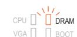

The memory status LED will light up if the memory module is installed in the incorrect slot before booting. Ensure that the memory module is installed in the correct slot. Refer to the table for memory installation instructions.

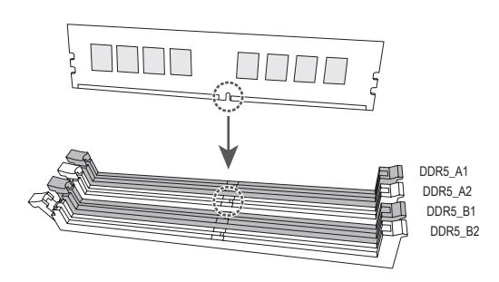

# **Dual Channel Memory Configuration**

This motherboard provides four memory sockets and supports Dual Channel Technology. After the memory is installed, the BIOS will automatically detect the specifications and capacity of the memory. Enabling Dual Channel memory mode will double the original memory bandwidth.

The four memory sockets are divided into two channels and each channel has two memory sockets as following:

Channel A: DDR5\_A1, DDR5\_A2

Channel B: DDR5\_B1, DDR5\_B2

Due to CPU limitations, read the following guidelines before installing the memory in Dual Channel mode.

- 1. Dual Channel mode cannot be enabled if only one memory module is installed.
- 2. When enabling Dual Channel mode with two or four memory modules, it is recommended that memory of the same capacity, brand, speed, and chips be used.

# **DDR Wind Blade**

The included DDR Wind Blade is specifically designed for memory cooling. Connect it to the designated fan header (see the table below) and you can read temperatures from the DDR temperature monitoring point (Note) and adjust the fan speed operating mode using the GIGABYTE Control Center. For setting details, please navigate to the "Unique Features" page of GIGABYTE's website and search for "FAN Control."

\* Fan headers supporting DDR PMIC temperature reading

| SYS_FAN4  |
|-----------|
| FAN5_PUMP |
| FAN6_PUMP |
| FAN7_PUMP |
| FAN8_PUMP |

GIGABYTE Control Center

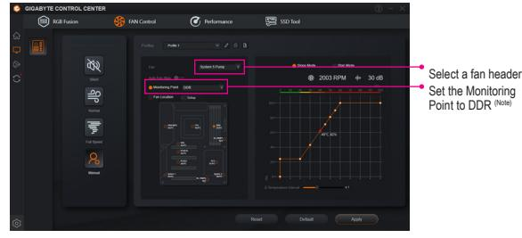

## **Installation**

Refer to the following two installation methods based on your actual needs. After installing, connect the fan header cable from the DDR Wind Blade to a fan header that supports DDR PMIC temperature reading.

**I. Attach to the computer case together with the motherboard (using the provided mounting screw)**

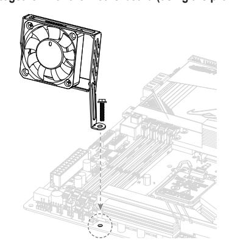

**II. Attach to an open-case test bench (using the provided push clip)**

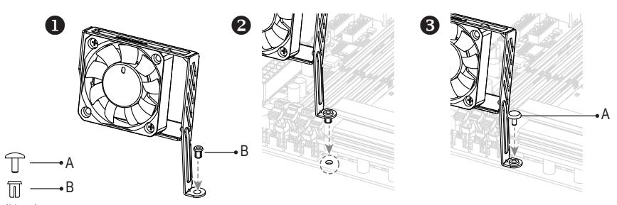

(Note) The DDR temperature monitoring point is available only when a memory module that supports this feature is installed. For further support information, please contact your memory vendor.

\* The images above are for reference only. Actual product appearance may vary.

# **2-5 Installing an Expansion Card**

Read the following guidelines before you begin to install an expansion card:

- Make sure the motherboard supports the expansion card. Carefully read the manual that came with your expansion card.
- Always turn off the computer and unplug the power cord from the power outlet before installing an expansion card to prevent hardware damage.

Follow the steps below to correctly install your expansion card in the expansion slot.

- 1. Locate an expansion slot that supports your card. Remove the metal slot cover from the chassis back panel.
- 2. Align the card with the slot, and press down on the card until it is fully seated in the slot.
- 3. Make sure that the expansion card is fully seated in its slot.
- 4. Secure the card's metal bracket to the chassis back panel with a screw.
- 5. After installing all expansion cards, replace the chassis cover(s).
- 6. Turn on your computer. If necessary, go to BIOS Setup to make any required BIOS changes for your expansion card(s).
- 7. Install the driver provided with the expansion card in your operating system.

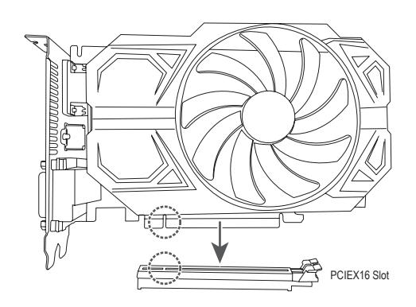

&amp; Please visit GIGABYTE's website for details on using PCIe EZ-Latch Plus. https://www.gigabyte.com/WebPage/922/removePCIE.html

# **2-6 Back Panel Connectors**

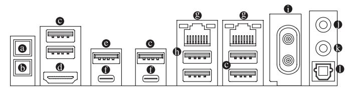

# **Q-Flash Plus Button (Note 1)**

Q-Flash Plus allows you to update the BIOS when your system is off (S5 shutdown state). Save the latest BIOS on a USB thumb drive and plug it into the dedicated port, and then you can now flash the BIOS automatically by simply pressing the Q-Flash Plus button. The Q-Flash Plus Button will flash when the BIOS matching and flashing activities start and will stop flashing when the main BIOS flashing is complete.

# **Clear CMOS Button**

Use this button to clear the CMOS values (e.g. BIOS configuration) and reset the CMOS values to factory defaults when needed.

- Always turn off your computer and unplug the power cord from the power outlet before using the clear CMOS button.
- Do not use the clear CMOS button when the system is on, or the system may shutdown and data loss or damage may occur.
- After system restart, go to BIOS Setup to load factory defaults (select Load Optimized Defaults) or manually configure the BIOS settings (please navigate to the "BIOS Setup" page of GIGABYTE's website for more information).

# **USB 3.2 Gen 2 Type-A Port (Red)**

The USB 3.2 Gen 2 port supports the USB 3.2 Gen 2 specification and is compatible to the USB 3.2 Gen 1 and USB 2.0 specification. Use this port for USB devices.

# **HDMI Port**

The HDMI port is HDCP 2.3 compliant and supports Dolby TrueHD and DTS HD Master Audio formats. It also supports up to 192KHz/24bit 7.1-channel LPCM audio output. You can use this port to connect your HDMI-supported monitor. The maximum supported resolution is 4096x2160@60 Hz, but the actual resolutions supported are dependent on the monitor being used.

After installing the HDMI device, make sure to set the default sound playback device to HDMI. (The item name may differ depending on your operating system.)

### **USB 3.2 Gen 2 Type-A Port (Red) (Q-Flash Plus Port)**

The USB 3.2 Gen 2 port supports the USB 3.2 Gen 2 specification and is compatible to the USB 3.2 Gen 1 and USB 2.0 specification. Use this port for USB devices. Before using Q-Flash Plus (Note 1), make sure to insert the USB flash drive into this port first.

# **USB4® USB Type-C® Port (DisplayPort (Note 2))**

This port supports standard USB4® USB Type-C® and DisplayPort display output. You can connect a USB4® USB Type-C® monitor to this port or use an adapter cable to connect a standard DisplayPort monitor. The maximum supported resolution is 3840x2160@240 Hz when using a DisplayPort monitor, but the actual resolutions supported are dependent on the monitor being used. Also, the connector is reversible and supports the USB4® specification and is compatible to the USB 3.2 Gen 2x2, USB 3.2 Gen 2, USB 3.2 Gen 1, and USB 2.0 specifications. You can use this port for USB devices, too.

(Note 1) To enable the Q-Flash Plus function, please navigate to the "Unique Features" page of GIGABYTE's website for more information.

(Note 2) Actual support may vary by CPU.

# **RJ-45 LAN Port**

The Gigabit Ethernet LAN port provides Internet connection at up to 10 GB data rate. The following describes the states of the LAN port LEDs.

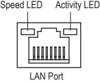

| Speed LED: |                                                 |
|------------|-------------------------------------------------|
| State      | Description                                     |
| Green      | 10 Gbps data rate                               |
| Orange     | 5 Gbps/ 2.5 Gbps/ 1 Gbps/ 100 Mbps data rate |

| Activity LED: |                                                |
|---------------|------------------------------------------------|
| State         | Description                                    |
| Blinking      | Data transmission or receiving is occurring    |
| On            | No data transmission or receiving is occurring |
|               |                                                |

# **USB 2.0/1.1 Port**

The USB port supports the USB 2.0/1.1 specification. Use this port for USB devices.

# **Antenna Connectors (2T2R)**

Use this connector to connect an antenna.

# **Line Out/Front Speaker Out**

The line out jack.

# **Mic In/Rear Speaker Out**

The Mic in jack.

# **Optical S/PDIF Out Connector**

This connector provides digital audio out to an external audio system that supports digital optical audio. Before using this feature, ensure that your audio system provides an optical digital audio in connector.

Audio Jack Configurations:

| Jack                                                | Headphone/ 2-channel | 4-channel | 5.1-channel |
|-----------------------------------------------------|-------------------------|-----------|-------------|
| Line Out/Front Speaker Out                          | a                       | a         | a           |
| Mic In/Rear Speaker Out                             |                         | a         | a           |
| Front Panel Line Out/Side Speaker Out               |                         |           |             |
| Front Panel Mic In/Center/Sub woofer Speaker Out |                         |           | a           |

You can change the functionality of an audio jack using the audio software. To configure 5.1-channel audio, access the audio software for audio settings.

& Please visit GIGABYTE's website for details on configuring the audio software. https://www.gigabyte.com/WebPage/698/realtek1220-audio.html

- When removing the cable connected to a back panel connector, first remove the cable from your device and then remove it from the motherboard.
- When removing the cable, pull it straight out from the connector. Do not rock it side to side to prevent an electrical short inside the cable connector.

# **2-7 Onboard Buttons, Voltage Measurement Points, and LEDs**

# **Quick Buttons**

This motherboard has 2 quick buttons: power button and reset button. The power button and reset button allow users to quickly turn on/off or reset the computer in an open-case environment when they want to change hardware components or conduct hardware testing.

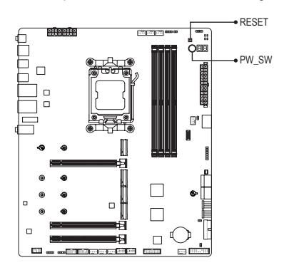

**RESET:** Reset Button **PW\_SW:** Power Button

The reset button provides you with several functions to use. To remap the button to perform different tasks, please navigate to the "BIOS Setup" page of GIGABYTE's website and search for "RST(MULTIKEY)" for more information.

### **Status LEDs**

The status LEDs show whether the CPU, memory, graphics card, and operating system are working properly after system power-on. If the CPU/DRAM/VGA LED is on, that means the corresponding device is not working normally; if the BOOT LED is on, that means you haven't entered the operating system yet.

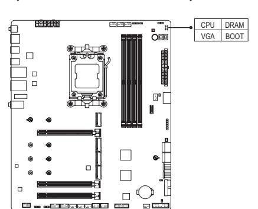

**CPU:** CPU status LED **DRAM:** Memory status LED **VGA:** Graphics card status LED **BOOT:** Operating system status LED

# **Voltage Measurement Points**

Use a multimeter to measure the following motherboard voltages.

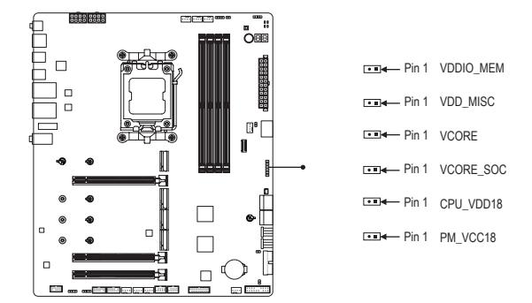

# 2-8 Internal Connectors

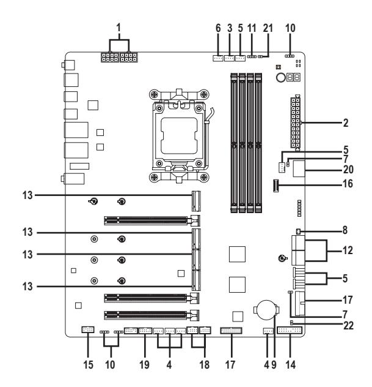

| 1)  | 12V_2X4_1/12V_2X4_2 | 12) | SATA3 0/1/2/3                |
|-----|---------------------|-----|------------------------------|
| 2)  | ATX                 | 13) | M2A_CPU/M2D_SB/M2B_SB/M2E_SB |
| 3)  | CPU_FAN             | 14) | F_PANEL                      |
| 4)  | SYS_FAN1/2/3/4      | 15) | F_AUDIO                      |
| 5)  | FAN5/6/7/8_PUMP     | 16) | FU3C_20G                     |
| 6)  | CPU_OPT             | 17) | FU3A_5G_1/FU3A_5G_2          |
| 7)  | EC_TEMP1/EC_TEMP2   | 18) | FUSB_1/FUSB_2                |
| 8)  | DB_SENSE            | 19) | SPI_TPM                      |
| 9)  | BAT                 | 20) | F_HDMI                       |
| 10) | ARGB_V2_1/2/3       | 21) | RST                          |
| 11) | LED_C               | 22) | CLR_CMOS                     |
|     |                     |     |                              |

Read the following guidelines before connecting external devices:

- First make sure your devices are compliant with the connectors you wish to connect.
- Before installing the devices, be sure to turn off the devices and your computer. Unplug the power cord from the power outlet to prevent damage to the devices.
- After installing the device and before turning on the computer, make sure the device cable has been securely attached to the connector on the motherboard.

# **1/2) 12V\_2X4\_1/12V\_2X4\_2/ATX (2x4 12V Power Connectors and 2x12 Main Power Connector)**

With the use of the power connector, the power supply can supply enough stable power to all the components on the motherboard. Before connecting the power connector, first make sure the power supply is turned off and all devices are properly installed. The power connector possesses a foolproof design. Connect the power supply cable to the power connector in the correct orientation.

The 12V power connector mainly supplies power to the CPU. If the 12V power connector is not connected, the computer will not start.

To meet expansion requirements, it is recommended that a power supply that can withstand high power consumption be used (500W or greater). If a power supply that does not provide the required power is used, it can result in an unstable or unbootable system.

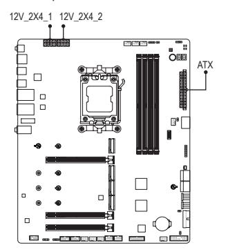

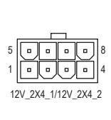

12V\_2X4\_1/12V\_2X4\_2:

| Pin No. | Definition                  |  |  |  |
|---------|-----------------------------|--|--|--|
| 1       | GND (Only for 2x4-pin 12V)  |  |  |  |
| 2       | GND (Only for 2x4-pin 12V)  |  |  |  |
| 3       | GND                         |  |  |  |
| 4       | GND                         |  |  |  |
| 5       | +12V (Only for 2x4-pin 12V) |  |  |  |
| 6       | +12V (Only for 2x4-pin 12V) |  |  |  |
| 7       | +12V                        |  |  |  |
| 8       | +12V                        |  |  |  |
|         |                             |  |  |  |

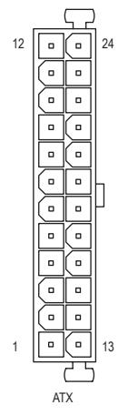

| ATX: |  |  |
|------|--|--|
|      |  |  |
|      |  |  |

| Pin No. | Definition                   | Pin No. | Definition                  |
|---------|------------------------------|---------|-----------------------------|
|         |                              |         |                             |
| 1       | 3.3V                         | 13      | 3.3V                        |
| 2       | 3.3V                         | 14      | -12V                        |
| 3       | GND                          | 15      | GND                         |
| 4       | +5V                          | 16      | PS_ON (soft On/Off)         |
| 5       | GND                          | 17      | GND                         |
| 6       | +5V                          | 18      | GND                         |
| 7       | GND                          | 19      | GND                         |
| 8       | Power Good                   | 20      | NC                          |
| 9       | 5VSB (stand by +5V)          | 21      | +5V                         |
| 10      | +12V                         | 22      | +5V                         |
| 11      | +12V (Only for 2x12-pin      | 23      | +5V (Only for 2x12-pin ATX) |
|         | ATX)                         |         |                             |
| 12      | 3.3V (Only for 2x12-pin ATX) | 24      | GND (Only for 2x12-pin ATX) |

# **3/4) CPU\_FAN/SYS\_FAN1/2/3/4 (Fan Headers)**

All fan headers on this motherboard are 4-pin. Most fan headers possess a foolproof insertion design. When connecting a fan cable, be sure to connect it in the correct orientation (the black connector wire is the ground wire). The speed control function requires the use of a fan with fan speed control design. For optimum heat dissipation, it is recommended that a system fan be installed inside the chassis.

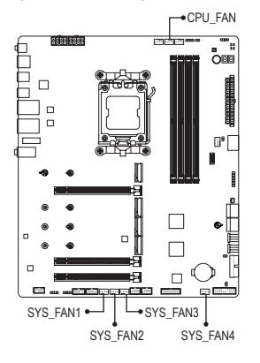

|   |         | 1 |
|---|---------|---|
|   | CPU_FAN |   |
| 1 |         |   |

SYS\_FAN1~4

| Pin No. | Definition            |
|---------|-----------------------|
| 1       | GND                   |
| 2       | Voltage Speed Control |
| 3       | Sense                 |
| 4       | PWM Speed Control     |

# **5) FAN5/6/7/8\_PUMP (System Fan/Water Cooling Pump Headers)**

The fan/pump headers are 4-pin. Most fan headers possess a foolproof insertion design. When connecting a fan cable, be sure to connect it in the correct orientation (the black connector wire is the ground wire). The speed control function requires the use of a fan with fan speed control design. For optimum heat dissipation, it is recommended that a system fan be installed inside the chassis. The header also provides speed control for a water cooling pump. Please navigate to the "BIOS Setup" page of GIGABYTE's website and search for "Smart Fan 6" for more information.

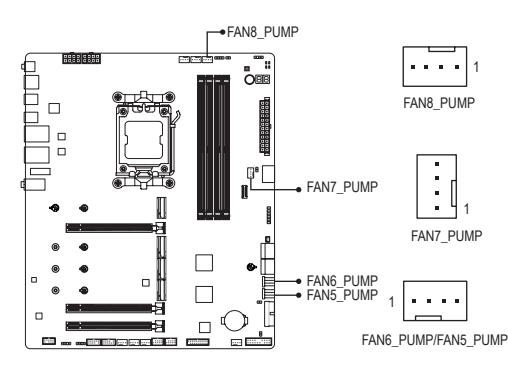

| Pin No. | Definition            |
|---------|-----------------------|
| 1       | GND                   |
| 2       | Voltage Speed Control |
| 3       | Sense                 |
| 4       | PWM Speed Control     |

The SYS\_FAN4 and FAN5, 6, 7, 8\_PUMP headers support DDR PMIC temperature reading.

- Be sure to connect fan cables to the fan headers to prevent your CPU and system from overheating. Overheating may result in damage to the CPU or the system may hang.
- These fan headers are not configuration jumper blocks. Do not place a jumper cap on the headers.

# **6) CPU\_OPT (CPU Fan/Water Cooling Pump Header)**

The fan/pump header is 4-pin and possesses a foolproof insertion design. Most fan headers possess a foolproof insertion design. When connecting a fan cable, be sure to connect it in the correct orientation (the black connector wire is the ground wire). The speed control function requires the use of a fan with fan speed control design.

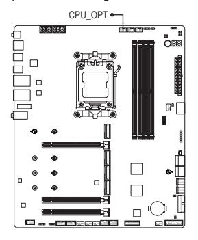

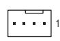

| Pin No. | Definition            |
|---------|-----------------------|
| 1       | GND                   |
| 2       | Voltage Speed Control |
| 3       | Sense                 |
| 4       | PWM Speed Control     |

| Connector       | CPU_FAN | SYS_FAN1~4 | FAN5~8_PUMP | CPU_OPT |
|-----------------|---------|------------|-------------|---------|
| Maximum Current | 2A      | 2A         | 2A          | 2A      |
| Maximum Power   | 24W     | 24W        | 24W         | 24W     |

- Be sure to connect fan cables to the fan headers to prevent your CPU and system from overheating. Overheating may result in damage to the CPU or the system may hang.
- These fan headers are not configuration jumper blocks. Do not place a jumper cap on the headers.

### **7) EC\_TEMP1/EC\_TEMP2 (Temperature Sensor Headers)**

Connect the thermistor cables to the headers for temperature detection.

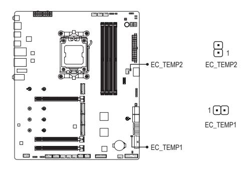

| Pin No. | Definition |
|---------|------------|
| 1       | SENSOR IN  |
| 2       | GND        |

### 8) DB SENSE (Noise Detection Header)

This header can be used to connect a noise detection cable to detect the noise inside the case.

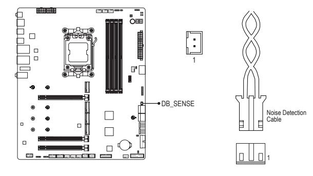

| Pin No. | Definition      |
|---------|-----------------|
| 1       | Noise Detection |
| 2       | GND             |
|         |                 |

For more information on the noise detection function, please navigate to the "Unique Features" page of GIGABYTE's website and search for "FAN Control."

Before connecting the cable to the header, make sure to remove the jumper cap; re-place the jumper cap if the header is not in use.

### 9) BAT (Battery)

The battery provides power to keep the values (such as BIOS configurations, date, and time information) in the CMOS when the computer is turned off. Replace the battery when the battery voltage drops to a low level, or the CMOS values may not be accurate or may be lost.

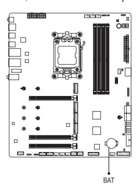

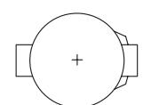

You may clear the CMOS values by removing the battery:

- 1. Turn off your computer and unplug the power cord.
- Gently remove the battery from the battery holder and wait for one minute. (Or use a metal object like a screwdriver to touch the positive and negative terminals of the battery holder, making them short for 5 seconds.)
- 3. Replace the battery.
- 4. Plug in the power cord and restart your computer.

- Always turn off your computer and unplug the power cord before replacing the battery.
- Replace the battery with an equivalent one. Damage to your devices may occur if the battery is replaced with an incorrect model.
- Contact the place of purchase or local dealer if you are not able to replace the battery by yourself
  or uncertain about the battery model.
- When installing the battery, note the orientation of the positive side (+) and the negative side (-)
  of the battery (the positive side should face up).
- Used batteries must be handled in accordance with local environmental regulations.

### 10) ARGB V2 1/2/3 (Addressable RGB Gen2 LED Strip Headers)

The headers can be used to connect a standard 5050 addressable RGB Gen2 LED strip, with maximum power rating of 3A (5V) and maximum number of 256 LEDs.

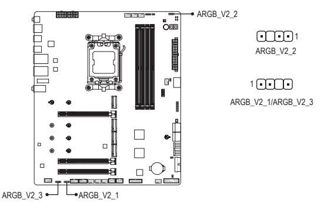

| Pin No. | Definition |
|---------|------------|
| 1       | V (5V)     |
| 2       | Data       |
| 3       | No Pin     |
| 4       | GND        |

Connect your addressable RGB Gen2 LED strip to the header. The power pin (marked with a triangle on the plug) of the LED strip must be connected to Pin 1 of the addressable LED strip header. Incorrect connection may lead to the damage of the LED strip.

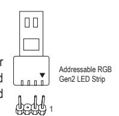

### 11) LED\_C (RGB LED Strip Header)

The header can be used to connect a standard 5050 RGB LED strip (12V/G/R/B), with maximum power rating of 2A (12V) and maximum length of 2m.

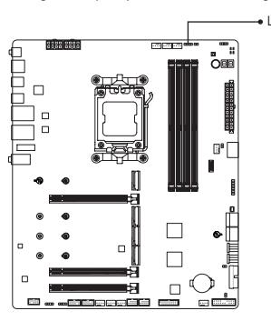

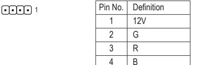

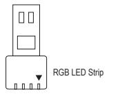

Connect your RGB LED strip to the header. The power pin (marked with a triangle on the plug) of the LED strip must be connected to Pin 1 (12V) of this header. Incorrect connection may lead to the damage of the LED strip.

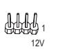

For how to turn on/off the lights of the LED strip, please navigate to the "Unique Features" page of GIGABYTE's website.

- To avoid abnormal LED behavior, do not connect addressable RGB Gen1 LED strips and addressable RGB Gen2 LED strips to the same header at the same time.
- Before installing or removing the devices, be sure to turn off the devices and your computer.
   Unplug the power cord from the power outlet to prevent damage to the devices.

### 12) SATA3 0/1/2/3 (SATA 6Gb/s Connectors)

The SATA connectors conform to SATA 6Gb/s standard and are compatible with SATA 3Gb/s and SATA 1.5Gb/s standard. Each SATA connector supports a single SATA device. The SATA connectors support RAID 0, RAID 1, and RAID 10. Please navigate to the "Configuring a RAID Set" page of GIGABYTE's website for instructions on configuring a RAID array.

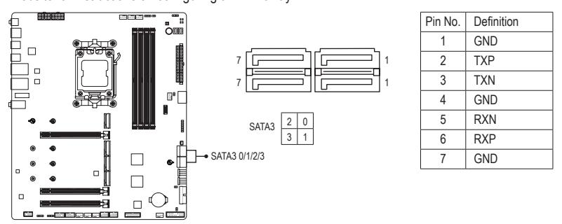

To enable hot-plugging for the SATA ports, please navigate to the "BIOS Setup" page of GIGABYTE's website and search for "SATA Configuration" for more information.

### 13) M2A CPU/M2D SB/M2B SB/M2E SB (M.2 Socket 3 Connectors)

There are two types of M.2 SSDs: M.2 SATA SSDs and M.2 PCIe SSDs. This motherboard only supports M.2 PCIe SSDs. Please note that an M.2 PCIe SSD cannot be used to create a RAID set with a SATA hard drive. Please navigate to the "Configuring a RAID Set" page of GIGABYTE's website for instructions on configuring a RAID array.

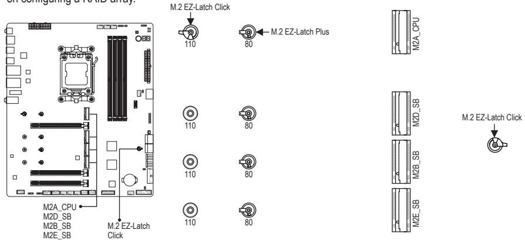

\* Types of M.2 SSDs supported by each M.2 connector:

|         | M.2 PCIe x4 SSD | M.2 PCle x2 SSD | M.2 SATA SSD |
|---------|-----------------|-----------------|--------------|
| M2A_CPU | ~               | ~               | ×            |
| M2D_SB  | ~               | ~               | ×            |
| M2B_SB  | ~               | ~               | ×            |
| M2E_SB  | ×               | ~               | ×            |

# • **Installing the M.2 thermal pad:**

When using a single-sided M.2 SSD, first attach the bundled M.2 thermal pad to the pre-installed thermal pad on the M.2 connector before installing the M.2 SSD.

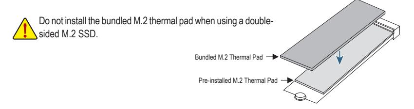

Follow the steps below to correctly install an M.2 SSD in the M.2 connector.

### • **M2A\_CPU:**

#### Step 1:

Turn the M.2 EZ-Latch Click clip clockwise and remove the motherboard heatsink.

If you want install an M.2 SSD in the 110mm hole, remove the EZ-Latch Plus clip from the 80mm hole first.

#### Step 2:

Remove the protective film from the thermal pad on the M.2 connector. Insert the M.2 SSD into the M.2 connector at an angle.

If you wish to replace the thermal pad, it is recommended to use one with a thickness of 1.25mm.

#### Step 3:

Press down on the front end of the M.2 SSD and make sure the M.2 SSD is secured by the clip. Remove the protective film from the bottom of the motherboard heatsink, and finally, turn the M.2 EZ-Latch Click clip clockwise and then install the heatsink back in place.

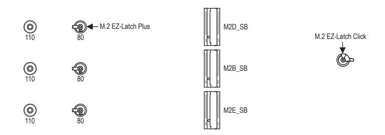

#### · M2D SB/M2B SB/M2E SB:

#### Step 1:

Turn the M.2 EZ-Latch Click clip clockwise and remove the motherboard heatsink. Locate the proper mounting hole for the M.2 SSD to be installed and secure the M.2 EZ-Latch Plus clip in the hole first.

#### Step 2

Remove the protective film from the thermal pad on the M.2 connector. Insert the M.2 SSD into the M.2 connector at an angle. Press down on the front end of the M.2 SSD and make sure the M.2 SSD is secured by the clip.

### Step 3:

Remove the protective film from the bottom of the motherboard heatsink, and finally, turn the M.2 EZ-Latch Click clip clockwise and then install the heatsink back in place.

Please visit GIGABYTE's website for details on using M.2 EZ-Latch Click/M.2 EZ-Latch Plus.

M.2 SSD installation with M.2 EZ-Latch Click: <a href="https://www.gigabyte.com/WebPage/1048/M.2-EZ-Latch-Click.html">https://www.gigabyte.com/WebPage/1048/M.2-EZ-Latch-Click.html</a>
M.2 SSD installation with M.2 EZ-Latch Plus: <a href="https://www.gigabyte.com/WebPage/920/M2-latchplus.html">https://www.gigabyte.com/WebPage/920/M2-latchplus.html</a>
\*Motherboard heatsink design may vary by model.

### 14) F PANEL (Front Panel Header)

Connect the power switch, reset switch, speaker, chassis intrusion switch/sensor and system status indicator on the chassis to this header according to the pin assignments below. Note the positive and negative pins before connecting the cables.

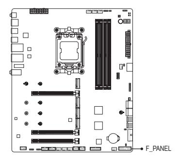

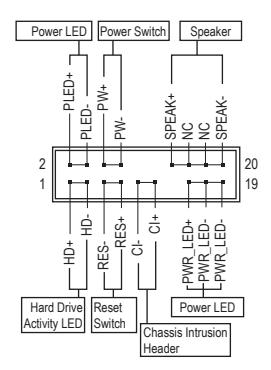

#### • PLED/PWR LED (Power LED):

| System Status | LED |
|---------------|-----|
| S0            | On  |
| S3/S4/S5      | Off |

Connects to the power status indicator on the chassis front panel. The LED is on when the system is operating. The LED is off when the system is in S3/S4 sleep state or powered off (S5).

#### · PW (Power Switch):

Connects to the power switch on the chassis front panel. You may configure the way to turn off your system using the power switch (please navigate to the "BIOS Setup" page of GIGABYTE's website and search for "Soft-Off by PWR-BTTN" for more information).

#### · SPEAK (Speaker):

Connects to the speaker on the chassis front panel. The system reports system startup status by issuing a beep code. One single short beep will be heard if no problem is detected at system startup.

#### . HD (Hard Drive Activity LED):

Connects to the hard drive activity LED on the chassis front panel. The LED is on when the hard drive is reading or writing data.

#### · RES (Reset Switch):

Connects to the reset switch on the chassis front panel. Press the reset switch to restart the computer if the computer freezes and fails to perform a normal restart.

#### . CI (Chassis Intrusion Header):

Connects to the chassis intrusion switch/sensor on the chassis that can detect if the chassis cover has been removed. This function requires a chassis with a chassis intrusion switch/sensor.

• NC: No Connection.

The front panel design may differ by chassis. A front panel module mainly consists of power switch, reset switch, power LED, hard drive activity LED, speaker and etc. When connecting your chassis front panel module to this header, make sure the wire assignments and the pin assignments are matched correctly.

### 15) F AUDIO (Front Panel Audio Header)

The front panel audio header supports High Definition audio (HD). You may connect your chassis front panel audio module to this header. Make sure the wire assignments of the module connector match the pin assignments of the motherboard header. Incorrect connection between the module connector and the motherboard header will make the device unable to work or even damage it.

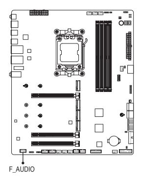

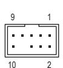

| Pin No. | Definition    |
|---------|---------------|
| 1       | MIC L         |
| 2       | GND           |
| 3       | MIC R         |
| 4       | NC            |
| 5       | Head Phone R  |
| 6       | MIC Detection |
| 7       | GND           |
| 8       | No Pin        |
| 9       | Head Phone L  |
| 10      | Head Phone    |
|         | Detection     |

Some chassis provide a front panel audio module that has separated connectors on each wire instead of a single plug. For information about connecting the front panel audio module that has different wire assignments, please contact the chassis manufacturer.

# 16) FU3C\_20G (USB Type-C® Header, with USB 3.2 Gen 2x2 Support)

The header conforms to USB 3.2 Gen 2x2 specification and can provide one USB port.

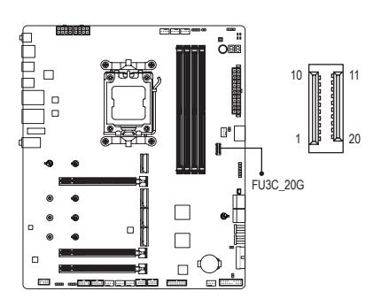

| Pin No. | Definition | Pin No. | Definition |
|---------|------------|---------|------------|
| 1       | VBUS       | 11      | VBUS       |
| 2       | TX1+       | 12      | TX2+       |
| 3       | TX1-       | 13      | TX2-       |
| 4       | GND        | 14      | GND        |
| 5       | RX1+       | 15      | RX2+       |
| 6       | RX1-       | 16      | RX2-       |
| 7       | VBUS       | 17      | GND        |
| 8       | CC1        | 18      | D-         |
| 9       | SBU1       | 19      | D+         |
| 10      | SBU2       | 20      | CC2        |

### 17) FU3A 5G 1/FU3A 5G 2 (USB 3.2 Gen 1 Headers)

The headers conform to USB 3.2 Gen 1 and USB 2.0 specification and each header can provide two USB ports. For purchasing the optional 3.5" front panel that provides two USB 3.2 Gen 1 ports, please contact the local dealer

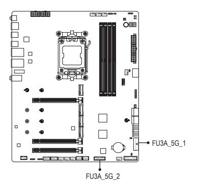

| Pin No. | Definition | Pin No. | Definition |
|---------|------------|---------|------------|
| 1       | VBUS       | 11      | D2+        |
| 2       | SSRX1-     | 12      | D2-        |
| 3       | SSRX1+     | 13      | GND        |
| 4       | GND        | 14      | SSTX2+     |
| 5       | SSTX1-     | 15      | SSTX2-     |
| 6       | SSTX1+     | 16      | GND        |
| 7       | GND        | 17      | SSRX2+     |
| 8       | D1-        | 18      | SSRX2-     |
| 9       | D1+        | 19      | VBUS       |
| 10      | NC         | 20      | No Pin     |

# 18) FUSB 1/FUSB 2 (USB 2.0/1.1 Headers)

The headers conform to USB 2.0/1.1 specification. Each USB header can provide two USB ports via an optional USB bracket. For purchasing the optional USB bracket, please contact the local dealer.

| Definition |
|------------|
| Power (5V) |
| Power (5V) |
| USB DX-    |
| USB DY-    |
| USB DX+    |
| USB DY+    |
| GND        |
| GND        |
| No Pin     |
| NC         |
|            |

Prior to installing the USB bracket, be sure to turn off your computer and unplug the power cord from the power outlet to prevent damage to the USB bracket.

### 19) SPI\_TPM (Trusted Platform Module Header)

You may connect an SPI TPM (Trusted Platform Module) to this header.

| Pin No. | Definition   |
|---------|--------------|
| 1       | Data Output  |
| 2       | Power (1.8V) |
| 3       | No Pin       |
| 4       | NC           |
| 5       | Data Input   |
| 6       | CLK          |
| 7       | Chip Select  |
| 8       | GND          |
| 9       | IRQ          |
| 10      | NC           |
| 11      | NC           |
| 12      | RST          |

# 20) F HDMI (HDMI Port) (Note)

This port supports HDMI display output, allowing you to connect a display screen inside a computer case. It can support a display screen with a maximum resolution of 1920x1080@30 Hz. The actual supported resolution may vary depending on the display screen you use. For instructions on how to connect a display screen inside your computer case, please refer to the user manual of the display screen.

(Note) Actual support may vary by CPU.

# **21) RST (Reset Jumper)**

The reset jumper can connect to the reset switch on the chassis front panel. Press the reset switch to restart the computer if the computer freezes and fails to perform a normal restart.

| Pin No. | Definition |
|---------|------------|
| 1       | Reset      |
| 2       | GND        |

The reset jumper provides you with several functions to use. To remap the button to perform different tasks, please navigate to the "BIOS Setup" page of GIGABYTE's website and search for "RST (MULTIKEY)" for more information.

# **22) CLR\_CMOS (Clear CMOS Jumper)**

Use this jumper to clear the BIOS configuration and reset the CMOS values to factory defaults. To clear the CMOS values, use a metal object like a screwdriver to touch the two pins for a few seconds.

- Always turn off your computer and unplug the power cord from the power outlet before clearing the CMOS values.
- After system restart, go to BIOS Setup to load factory defaults (select Load Optimized Defaults) or manually configure the BIOS settings (please navigate to the "BIOS Setup" page of GIGABYTE's website for more information).

# **Chapter 3 BIOS Setup**

BIOS (Basic Input and Output System) records hardware parameters of the system in the CMOS on the motherboard. Its major functions include conducting the Power-On Self-Test (POST) during system startup, saving system parameters and loading operating system, etc. BIOS includes a BIOS Setup program that allows the user to modify basic system configuration settings or to activate certain system features.

When the power is turned off, the battery on the motherboard supplies the necessary power to the CMOS to keep the configuration values in the CMOS.

To access the BIOS Setup program, press the <Delete> key during the POST when the power is turned on.

To upgrade the BIOS, use either the GIGABYTE Q-Flash or Q-Flash Plus utility.

- Q-Flash allows the user to quickly and easily upgrade or back up BIOS without entering the operating system.
- Q-Flash Plus allows you to update the BIOS when your system is off (S5 shutdown state). Save the latest BIOS on a USB thumb drive and plug it into the dedicated port, and then you can now flash the BIOS automatically by simply pressing the Q-Flash Plus button.

For instructions on using the Q-Flash and Q-Flash Plus utilities, please navigate to the "Unique Features" page of GIGABYTE's website and search for "BIOS Update Utilities."

- Because BIOS flashing is potentially risky, if you do not encounter problems using the current version of BIOS, it is recommended that you not flash the BIOS. To flash the BIOS, do it with caution. Inadequate BIOS flashing may result in system malfunction.
- It is recommended that you not alter the default settings (unless you need to) to prevent system instability or other unexpected results. Inadequately altering the settings may result in system's failure to boot. If this occurs, try to clear the CMOS values and reset the board to default values.
- Refer to the introductions of the battery/clear CMOS jumper/button in Chapter 2 or navigate to the "BIOS Setup" page of GIGABYTE's website and search for "Load Optimized Defaults" for how to clear the CMOS values.

&amp; Please visit GIGABYTE's website for details on configuring BIOS Setup. https://www.gigabyte.com/WebPage/1081/amd800-bios.html

# **Startup Screen:**

The following startup Logo screen appear when the computer boots.

# **Function Keys:**

# **<DEL>: BIOS SETUP\Q-FLASH**

Press the <Delete> key to enter BIOS Setup or to access the Q-Flash utility in BIOS Setup.

#### **<F12>: BOOT MENU**

Boot Menu allows you to set the first boot device without entering BIOS Setup. In Boot Menu, use the up arrow key <h> or the down arrow key <i> to select the first boot device, then press <Enter> to accept. The system will boot from the device immediately.

Note: The setting in Boot Menu is effective for one time only. After system restart, the device boot order will still be based on BIOS Setup settings.

### **<END>: Q-FLASH**

Press the <End> key to access the Q-Flash utility directly without having to enter BIOS Setup first.

# **Chapter 4 Installing the Operating System and Drivers**

# **4-1 Operating System Installation**

With the correct BIOS settings, you are ready to install the operating system.

As some operating systems already include RAID driver, you do not need to install separate RAID driver during the Windows installation process. After the operating system is installed, we recommend that you install all required drivers from the GIGABYTE Control Center to ensure system performance and compatibility. If the operating system to be installed requires that you provide additional RAID driver during the OS installation process, please refer to the steps below:

### Step 1:

Go to GIGABYTE's website, browse to the motherboard model's web page, download the **AMD RAID Preinstall Driver** file on the **Support\Download\SATA RAID/AHCI** page, unzip the file and copy the files to your USB thumb drive.

### Step 2:

Boot from the Windows setup disc and perform standard OS installation steps. When the screen requesting you to load the driver appears, select **Browse**.

### Step 3:

Insert the USB thumb drive and then browse to the location of the drivers. Follow the on-screen instructions to install the following three drivers in order.

- j **AMD-RAID Bottom Device**
- k **AMD-RAID Controller**
- l **AMD-RAID Config Device**

Finally, continue the OS installation.

# **4-2 Drivers Installation**

After you install the operating system, a dialog box will appear on the bottom-right corner of the desktop asking if you want to download and install the drivers and GIGABYTE applications via GIGABYTE Control Center (GCC). Click **Install** to proceed with the installation. (In BIOS Setup, make sure **Settings\IO Ports\Gigabyte Utilities Downloader Configuration\Gigabyte Utilities Downloader** is set to **Enabled**.)

When the EULA (End User License Agreement) dialog box appears, press <Accept> to install GIGABYTE Control Center (GCC). On the GIGABYTE CONTROL CENTER screen, select the drivers and applications you want to install and click **Install**.

Before the installation, make sure the system is connected to the Internet.

- & Please visit GIGABYTE's website for more software information. https://www.gigabyte.com/WebPage/1082/amd800-app.html
- & Please visit GIGABYTE's website for more troubleshooting information. https://www.gigabyte.com/WebPage/351/faq.html

# **Chapter 5 Appendix**

# **5-1 Configuring a RAID Set**

## **RAID Levels**

|                                     | RAID 0                                                   | RAID 1                        | RAID 5 (Note)                                                 | RAID 10                                                      |
|-------------------------------------|----------------------------------------------------------|-------------------------------|---------------------------------------------------------------|--------------------------------------------------------------|
| Minimum Number of Hard Drives | ≥2                                                       | 2                             | ≥3                                                            | 4                                                            |
| Array Capacity                      | Number of hard drives * Size of the smallest drive | Size of the smallest drive | (Number of hard drives -1) * Size of the smallest drive | (Number of hard drives/2) * Size of the smallest drive |
| Fault Tolerance                     | No                                                       | Yes                           | Yes                                                           | Yes                                                          |

### **Before you begin, please prepare the following items:**

This motherboard supports RAID 0, RAID 1, RAID 5, and RAID 10. Prepare the correct number of hard drives as indicated in the table above before configuring a RAID array.

- SATA hard drives or SSDs. To ensure optimal performance, it is recommended that you use two hard drives with identical model and capacity.
- Windows setup disc.
- An Internet connected computer.
- A USB thumb drive.

An M.2 PCIe SSD cannot be used to set up a RAID set with a SATA hard drive.

(Note) Only available on NVMe SSDs with the AMD Ryzen™ 9000 Series Processors.

&amp; Please visit GIGABYTE's website for details on configuring a RAID array. https://www.gigabyte.com/WebPage/1080/amd800-raid.html

# **5-2 Debug LED Codes**

# **Regular Boot**

| Code  | Description                                             |  |  |  |
|-------|---------------------------------------------------------|--|--|--|
| 10    | PEI Core is started.                                    |  |  |  |
| 11    | Pre-memory CPU initialization is started.               |  |  |  |
| 12~14 | Reserved.                                               |  |  |  |
| 15    | Pre-memory North-Bridge initialization is started.      |  |  |  |
| 16~18 | Reserved.                                               |  |  |  |
| 19    | Pre-memory South-Bridge initialization is started.      |  |  |  |
| 1A~2A | Reserved.                                               |  |  |  |
| 2B~2F | Memory initialization.                                  |  |  |  |
| 31    | Memory installed.                                       |  |  |  |
| 32~36 | CPU PEI initialization.                                 |  |  |  |
| 37~3A | IOH PEI initialization.                                 |  |  |  |
| 3B~3E | PCH PEI initialization.                                 |  |  |  |
| 3F~4F | Reserved.                                               |  |  |  |
| 60    | DXE Core is started.                                    |  |  |  |
| 61    | NVRAM initialization.                                   |  |  |  |
| 62    | Installation of the PCH runtime services.               |  |  |  |
| 63~67 | CPU DXE initialization is started.                      |  |  |  |
| 68    | PCI host bridge initialization is started.              |  |  |  |
| 69    | IOH DXE initialization.                                 |  |  |  |
| 6A    | IOH SMM initialization.                                 |  |  |  |
| 6B~6F | Reserved.                                               |  |  |  |
| 70    | PCH DXE initialization.                                 |  |  |  |
| 71    | PCH SMM initialization.                                 |  |  |  |
| 72    | PCH devices initialization.                             |  |  |  |
| 73~77 | PCH DXE initialization (PCH module specific).           |  |  |  |
| 78    | ACPI Core initialization.                               |  |  |  |
| 79    | CSM initialization is started.                          |  |  |  |
| 7A~7F | Reserved for AMI use.                                   |  |  |  |
| 80~8F | Reserved for OEM use (OEM DXE initialization codes).    |  |  |  |
| 90    | Phase transfer to BDS (Boot Device Selection) from DXE. |  |  |  |
| 91    | Issue event to connect drivers.                         |  |  |  |

| Code  | Description                                                               |  |  |  |
|-------|---------------------------------------------------------------------------|--|--|--|
| 92    | PCI Bus initialization is started.                                        |  |  |  |
| 93    | PCI Bus hot plug initialization.                                          |  |  |  |
| 94    | PCI Bus enumeration for detecting how many resources are requested.       |  |  |  |
| 95    | Check PCI device requested resources.                                     |  |  |  |
| 96    | Assign PCI device resources.                                              |  |  |  |
| 97    | Console Output devices connect (ex. Monitor is lighted).                  |  |  |  |
| 98    | Console input devices connect (ex. PS2/USB keyboard/mouse are activated). |  |  |  |
| 99    | Super IO initialization.                                                  |  |  |  |
| 9A    | USB initialization is started.                                            |  |  |  |
| 9B    | Issue reset during USB initialization process.                            |  |  |  |
| 9C    | Detect and install all currently connected USB devices.                   |  |  |  |
| 9D    | Activated all currently connected USB devices.                            |  |  |  |
| 9E~9F | Reserved.                                                                 |  |  |  |
| A0    | IDE initialization is started.                                            |  |  |  |
| A1    | Issue reset during IDE initialization process.                            |  |  |  |
| A2    | Detect and install all currently connected IDE devices.                   |  |  |  |
| A3    | Activated all currently connected IDE devices.                            |  |  |  |
| A4    | SCSI initialization is started.                                           |  |  |  |
| A5    | Issue reset during SCSI initialization process.                           |  |  |  |
| A6    | Detect and install all currently connected SCSI devices.                  |  |  |  |
| A7    | Activated all currently connected SCSI devices.                           |  |  |  |
| A8    | Verify password if needed.                                                |  |  |  |
| A9    | BIOS Setup is started.                                                    |  |  |  |
| AA    | Reserved.                                                                 |  |  |  |
| AB    | Wait user command in BIOS Setup.                                          |  |  |  |
| AC    | Reserved.                                                                 |  |  |  |
| AD    | Issue Ready To Boot event for OS Boot.                                    |  |  |  |
| AE    | Boot to Legacy OS.                                                        |  |  |  |
| AF    | Exit Boot Services.                                                       |  |  |  |
| B0    | Runtime AP installation begins.                                           |  |  |  |
| B1    | Runtime AP installation ends.                                             |  |  |  |
| B2    | Legacy Option ROM initialization.                                         |  |  |  |
| B3    | System reset if needed.                                                   |  |  |  |

| Code  | Description                 |
|-------|-----------------------------|
| B4    | USB device hot plug-in.     |
| B5    | PCI device hot plug.        |
| B6    | Clean-up of NVRAM.          |
| B7    | Reconfigure NVRAM settings. |
| B8~BF | Reserved.                   |
| C0~CF | Reserved.                   |

# **S3 Resume**

| Code | Description                                |  |  |
|------|--------------------------------------------|--|--|
| E0   | S3 Resume is stared (called from DXE IPL). |  |  |
| E1   | Fill boot script data for S3 resume.       |  |  |
| E2   | Initializes VGA for S3 resume.             |  |  |
| E3   | OS S3 wake vector call.                    |  |  |

## **Recovery**

| Code  | Description                                                               |
|-------|---------------------------------------------------------------------------|
| F0    | Recovery mode will be triggered due to invalid firmware volume detection. |
| F1    | Recovery mode will be triggered by user decision.                         |
| F2    | Recovery is started.                                                      |
| F3    | Recovery firmware image is found.                                         |
| F4    | Recovery firmware image is loaded.                                        |
| F5~F7 | Reserved for future AMI progress codes.                                   |

# **Error**

| Code  | Description                                                 |  |  |
|-------|-------------------------------------------------------------|--|--|
| 50~55 | Memory initialization error occurs.                         |  |  |
| 56    | Invalid CPU type or speed.                                  |  |  |
| 57    | CPU mismatch.                                               |  |  |
| 58    | CPU self test failed or possible CPU cache error.           |  |  |
| 59    | CPU micro-code is not found or micro-code update is failed. |  |  |
| 5A    | Internal CPU error.                                         |  |  |
| 5B    | Reset PPI is failed.                                        |  |  |
| 5C~5F | Reserved.                                                   |  |  |
| D0    | CPU initialization error.                                   |  |  |
| D1    | IOH initialization error.                                   |  |  |

| Code  | Description                                            |  |  |  |
|-------|--------------------------------------------------------|--|--|--|
| D2    | PCH initialization error.                              |  |  |  |
| D3    | Some of the Architectural Protocols are not available. |  |  |  |
| D4    | PCI resource allocation error. Out of Resources.       |  |  |  |
| D5    | No Space for Legacy Option ROM initialization.         |  |  |  |
| D6    | No Console Output Devices are found.                   |  |  |  |
| D7    | No Console Input Devices are found.                    |  |  |  |
| D8    | It is an invalid password.                             |  |  |  |
| D9~DA | Can't load Boot Option.                                |  |  |  |
| DB    | Flash update is failed.                                |  |  |  |
| DC    | Reset protocol is failed.                              |  |  |  |
| DE~DF | Reserved.                                              |  |  |  |
| E8    | S3 resume is failed.                                   |  |  |  |
| E9    | S3 Resume PPI is not found.                            |  |  |  |
| EA    | S3 Resume Boot Script is invalid.                      |  |  |  |
| EB    | S3 OS Wake call is failed.                             |  |  |  |
| EC~EF | Reserved.                                              |  |  |  |
| F8    | Recovery PPI is invalid.                               |  |  |  |
| F9    | Recovery capsule is not found.                         |  |  |  |
| FA    | Invalid recovery capsule.                              |  |  |  |
| FB~FF | Reserved.                                              |  |  |  |

# **Regulatory Notices**

#### **United States of America, Federal Communications Commission Statement**

**Supplier's Declaration of Conformity 47 CFR § 2.1077 Compliance Information**

Product Name: **Motherboard** Trade Name: **GIGABYTE**

Model Number: **X870E A XTREME AI TOP**

Responsible Party – U.S. Contact Information: **G.B.T. Inc.**  Address: 17358 Railroad street, City Of Industry, CA91748 Tel.: 1-626-854-9338 Internet contact information: https://www.gigabyte.com

#### **FCC Compliance Statement:**

This device complies with Part 15 of the FCC Rules, Subpart B, Unintentional Radiators. Operation is subject to the following two conditions: (1) This device may not cause harmful interference, and (2) this device must accept any interference received, including interference that may cause undesired operation.

The FCC with its action in ET Docket 96-8 has adopted a safety standard for human exposure to radio frequency (RF) electromagnetic energy emitted by FCC certified equipment. The Intel PRO/Wireless 5000 LAN products meet the Human Exposure limits found in OET Bulletin 65, 2001, and ANSI/ IEEE C95.1, 1992. Proper operation of this radio according to the instructions found in this manual will result in exposure substantially below the FCC's recommended limits.

The following safety precautions should be observed:

- Do not touch or move antenna while the unit is transmitting or receiving.
- Do not hold any component containing the radio such that the antenna is very close or touching any exposed parts of the body, especially the face or eyes, while transmitting.
- Do not operate the radio or attempt to transmit data unless the antenna is connected; if not, the radio may be damaged.
- Use in specific environments:
  - The use of wireless devices in hazardous locations is limited by the constraints posed by the safety directors of such environments.
  - The use of wireless devices on airplanes is governed by the Federal Aviation Administration (FAA).
  - The use of wireless devices in hospitals is restricted to the limits set forth by each hospital.

#### **Antenna use:**

In order to comply with FCC RF exposure limits, low gain integrated antennas should be located at a minimum distance of 7.9 inches (20 cm) or more from the body of all persons.

#### **Explosive Device Proximity Warning**

Warning: Do not operate a portable transmitter (such as a wireless network device) near unshielded blasting caps or in an explosive environment unless the device has been modified to be qualified for such use.

#### **Antenna Warning**

The wireless adapter is not designed for use with high-gain antennas.

#### **Use On Aircraft Caution**

Caution: Regulations of the FCC and FAA prohibit airborne operation of radio-frequency wireless devices because their signals could interfere with critical aircraft instruments.

#### **Other Wireless Devices**

Safety Notices for Other Devices in the Wireless Network: Refer to the documentation supplied with wireless Ethernet adapters or other devices in the wireless network.

#### **Canada, Canada-Industry Notice:**

This device complies with Industry Canada license-exempt RSS standard(s). Operation is subject to the following two conditions:

- (1) this device may not cause interference, and
- (2) this device must accept any interference, including interference that may cause undesired operation of the device.
- Cet appareil est conforme aux normes Canada d'Industrie de RSS permis-exempt. L'utilisation est assujetti aux deux conditions suivantes:
- (1) le dispositif ne doit pas produire de brouillage préjudiciable, et
- (2) ce dispositif doit accepter tout brouillage reçu, y compris un brouillage susceptible de provoquer un fonctionnement indésirable.

**Caution:** When using IEEE 802.11a wireless LAN, this product is restricted to indoor use due to its operation in the 5.15-to 5.25-GHz frequency range. Industry Canada requires this product to be used indoors for the frequency range of 5.15 GHz to 5.25 GHz to reduce the potential for harmful interference to co-channel mobile satellite systems. High power radar is allocated as the primary user of the 5.25-to 5.35-GHz and 5.65 to 5.85-GHz bands. These radar stations can cause interference with and/or damage to this device. The maximum allowed antenna gain for use with this device is 6dBi in order tocomply with the E.I.R.P limit for the 5.25-to 5.35 and 5.725 to 5.85 GHz frequency range in point-to-point operation. To comply with RF exposure requirements all antennas should be located at a minimum distance of 20cm, or the minimum separation distance allowed by the module approval, from the body of all persons.

**Attention:** l'utilisation d'un réseau sans fil IEEE802.11a est restreinte à une utilisation en intérieur à cause du fonctionnement dansla bande de fréquence 5.15-5.25 GHz. Industry Canada requiert que ce produit soit utilisé à l'intérieur des bâtiments pour la bande de fréquence 5.15-5.25 GHz afin de réduire les possibilités d'interférences nuisibles aux canaux co-existants des systèmes de transmission satellites. Les radars de puissances ont fait l'objet d'une allocation primaire de fréquences dans les bandes 5.25-5.35 GHz et 5.65-5.85 GHz. Ces stations radar peuvent créer des interférences avec ce produit et/ou lui être nuisible. Le gain d'antenne maximum permissible pour une utilisation avec ce produit est de 6 dBi afin d'être conforme aux limites de puissance isotropique rayonnée équivalente (P.I.R.E.) applicable dans les bandes 5.25-5.35 GHz et 5.725-5.85 GHz en fonctionnement point-à-point. Pour se conformer aux conditions d'exposition de RF toutes les antennes devraient être localisées à une distance minimum de 20 cm, ou la distance de séparation minimum permise par l'approbation du module, du corps de toutes les personnes.

Under Industry Canada regulations, this radio transmitter may only operate using an antenna of a type and maximum (or lesser) gain approved for the transmitter by Industry Canada. To reduce potential radio interference to other users, the antenna type and its gain should be chosen so that the equivalent isotropically radiated power (e.i.r.p.) is not more than that necessary for successful communication.

Conformément à la réglementation d'Industrie Canada, le présent émetteur radio peut fonctionner avec une antenne d'un type et d'un gain maximal (ou inférieur) approuvé pour l'émetteur par Industrie Canada. Dans le but de réduire les risques de brouillage radio électrique à l'intention des autres utilisateurs, il faut choisir le type d'antenne et son gain de sorte que la puissance isotrope rayonnée équivalente (p.i.r.e.) ne dépasse pas l'intensité nécessaire à l'établissement d'une communication satisfaisante.

**European Union (EU) CE Declaration of Conformity**

This device complies with the following directives: Electromagnetic Compatibility Directive 2014/30/EU, Low-voltage Directive 2014/35/EU, Radio Equipment Directive 2014/53/EU, ErP Directive 2009/125/EC, RoHS directive (recast) 2011/65/EU & the 2015/863 Statement.

This product has been tested and found to comply with all essential requirements of the Directives.

**European Union (EU) RoHS (recast) Directive 2011/65/EU & the European Commission Delegated Directive (EU) 2015/863 Statement** GIGABYTE products have not intended to add and safe from hazardous substances (Cd, Pb, Hg, Cr+6, PBDE, PBB, DEHP, BBP, DBP and DIBP). The parts and components have been carefully selected to meet RoHS requirement. Moreover, we at GIGABYTE are continuing our efforts to develop products that do not use internationally banned toxic chemicals.

#### **European Union (EU) Community Waste Electrical & Electronic Equipment (WEEE) Directive Statement**

GIGABYTE will fulfill the national laws as interpreted from the 2012/19/ EU WEEE (Waste Electrical and Electronic Equipment) (recast) directive. The WEEE Directive specifies the treatment, collection, recycling and disposal of electric and electronic devices and their components. Under the Directive, used equipment must be marked, collected separately, and disposed of properly.

#### **WEEE Symbol Statement**

The symbol shown below is on the product or on its packaging, which indicates that this product must not be disposed of with other waste. Instead, the device should be taken to the waste collection centers for activation of the treatment, collection, recycling and disposal procedure.

For more information about where you can drop off your waste equipment for recycling, please contact your local government office, your household waste disposal service or where you purchased the product for details of environmentally safe recycling.

**Battery Information**

European Union—Disposal and recycling information GIGABYTE Recycling Program (available in some regions)

This symbol indicates that this product and/or battery should not be disposed of with household waste. You must use the public collection system to return, recycle, or treat them in compliance with the local regulations.

#### **End of Life Directives-Recycling**

The symbol shown below is on the product or on its packaging, which indicates that this product must not be disposed of with other waste. Instead, the device should be taken to the waste collection centers for activation of the treatment, collection, recycling and disposal procedure.

For any support regarding the EU General Product Safety Regulation (GPSR), please contact Giga-Byte Technology B.V. Steenoven 24, 5626 DK Eindhoven, Netherlands. [Email: EU.grp@gigabyte.com](mailto:EU.grp%40gigabyte.com?subject=)

# **Déclaration de Conformité aux Directives de l'Union européenne (UE)**

Cet appareil portant la marque CE est conforme aux directives de l'UE suivantes: directive Compatibilité Electromagnétique 2014/30/UE, directive Basse Tension 2014/35/UE, directive équipements radioélectriques 2014/53/UE, la directive RoHS II 2011/65/UE & la déclaration 2015/863. La conformité à ces directives est évaluée sur la base des normes européennes harmonisées applicables.

**European Union (EU) CE-Konformitätserklärung**

Dieses Produkte mit CE-Kennzeichnung erfüllen folgenden EU-Richtlinien: EMV-Richtlinie 2014/30/EU, Niederspannungsrichtlinie 2014/35/EU, Funkanlagen Richtlinie 2014/53/EU, RoHS-Richtlinie 2011/65/EU erfüllt und die 2015/863 Erklärung.

Die Konformität mit diesen Richtlinien wird unter Verwendung der entsprechenden Standards zurEuropäischen Normierung beurteilt.

#### **CE declaração de conformidade**

Este produto com a marcação CE estão em conformidade com das seguintes Diretivas UE: Diretiva Baixa Tensão 2014/35/EU; Diretiva CEM 2014/30/EU; Diretiva RSP 2011/65/UE e a declaração 2015/863. A conformidade com estas diretivas é verificada utilizando as normas europeias harmonizadas.

#### **CE Declaración de conformidad**

Este producto que llevan la marca CE cumplen con las siguientes Directivas de la Unión Europea: Directiva EMC 2014/30/EU, Directiva de bajo voltaje 2014/35/EU, Directiva de equipamentos de rádio 2014/53/EU, Directiva RoHS 2011/65/EU y la Declaración 2015/863.

El cumplimiento de estas directivas se evalúa mediante las normas europeas armonizadas.

#### **CE Dichiarazione di conformità**

I prodotti con il marchio CE sono conformi con una o più delle seguenti Direttive UE, come applicabile: Direttiva EMC 2014/30/UE, Direttiva sulla bassa tensione 2014/35/UE, Direttiva di apparecchiature radio 2014/53/ UE, Direttiva RoHS 2011/65/EU e Dichiarazione 2015/863.

La conformità con tali direttive viene valutata utilizzando gli Standard europei armonizzati applicabili.

#### **Deklaracja zgodności UE Unii Europejskiej**

Urządzenie jest zgodne z następującymi dyrektywami: Dyrektywa kompatybilności elektromagnetycznej 2014/30/UE, Dyrektywa niskonapięciowej 2014/35/UE, Dyrektywa urządzeń radiowych 2014/53/ UE, Dyrektywa RoHS 2011/65/UE i dyrektywa2015/863.

Niniejsze urządzenie zostało poddane testom i stwierdzono jego zgodność z wymaganiami dyrektywy.

#### **ES Prohlášení o shodě**

Toto zařízení splňuje požadavky Směrnice o Elektromagnetické kompatibilitě 2014/30/EU, Směrnice o Nízkém napětí 2014/35/EU, Směrnice o rádiových zařízeních 2014/53/EU, Směrnice RoHS 2011/65/ EU a 2015/863.

Tento produkt byl testován a bylo shledáno, že splňuje všechny základní požadavky směrnic.

#### **EK megfelelőségi nyilatkozata**

A termék megfelelnek az alábbi irányelvek és szabványok követelményeinek, azok a kiállításidőpontjában érvényes, aktuális változatában: EMC irányelv 2014/30/EU, Kisfeszültségű villamos berendezésekre vonatkozó irányelv 2014/35/EU, rádióberendezések irányelv 2014/53/EU, RoHS irányelv 2011/65/EU és 2015/863.

#### **Δήλωση συμμόρφωσης ΕΕ**

Είναι σε συμμόρφωση με τις διατάξεις των παρακάτω Οδηγιών της Ευρωπαϊκής Κοινότητας: Οδηγία 2014/30/ΕΕ σχετικά με την ηλεκτρομαγνητική συμβατότητα, Οοδηγία χαμηλή τάση 2014/35/EU, Οδηγία 2014/53/ΕΕ σε ραδιοεξοπλισμό, Οδηγία RoHS 2011/65/ΕΕ και 2015/863.

Η συμμόρφωση με αυτές τις οδηγίες αξιολογείται χρησιμοποιώντας τα ισχύοντα εναρμονισμένα ευρωπαϊκά πρότυπα.

#### **WARNING**

- **INGESTION HAZARD:** This product contains a button cell or coin battery.
- **DEATH** or serious injury can occur if ingested.
- A swallowed button cell or coin battery can cause **Internal Chemical Burns** in as little as **2 hours**.
- **KEEP** new and used batteries **OUT OF REACH of CHILDREN** • **Seek immediate medical attention** if a battery is suspected to
  - be swallowed or inserted inside any part of the body.

- Battery type: CR2032, voltage rating: +3VDC.
- Non-rechargeable batteries are not to be recharged.
- Remove and immediately recycle or dispose of used batteries, batteries from equipment not used for an extended period of time according to local regulations and keep away from children. Do NOT dispose of batteries in household trash or incinerate.
- Even used batteries may cause severe injury or death.
- Do not force discharge, recharge, disassemble, heat above (manufacturer's specified temperature rating) or incinerate. Doing so may result in injury due to venting, leakage or explosion resulting in chemical burns.
- For treatment information, call a local poison control center.
- The product contains non-replaceable batteries.

#### **European Community Directive R&TTE Directive Compliance Statement:**

This equipment complies with all the requirements and other relevant provisions of Radio Equipment Directive 2014/53/EU.

The IEEE 802.11 wireless LAN 5.15 GHz–5.35 GHz and/or Wi-Fi 6E Low Power Indoor 5.945 GHz–6.425 GHz (or 5.925 GHz–6.425 GHz in UK) frequency bands are restricted for indoor use only in all countries listed in the matrix below.

|    | AT | BE | BG | CH | CY | CZ | DE |
|----|----|----|----|----|----|----|----|
|    | DK | EE | EL | ES | FI | FR | HR |
| HU | IE | IS | IT | LI | LT | LU |    |
| LV | MT | NL | PL | PT | RO | SE |    |
|    | SI | SK | TR |    |    |    |    |

#### **UK The Radio Equipment Regulations 2017 Statement:**

This equipment complies with all the requirements and other relevant provisions of Radio Equipment Regulations 2017.

The IEEE 802.11 wireless LAN 5.15 GHz–5.35 GHz and/or Wi-Fi 6E Low Power Indoor 5.925 GHz–6.425 GHz frequency bands are restricted for indoor use only.

#### **NCC Wireless Statements / 無線設備警告聲明:**

低功率電波輻射性電機管理辦法

- (1) 取得審驗證明之低功率射頻器材,非經核准,公司、商號或使用者均不得擅自變更頻率、加大功率或變更原設計之 特性及功能。低功率射頻器材之使用不得影響飛航安全及干擾合法通信;經發現有干擾現象時,應立即停用,並改 善至無干擾時方得繼續使用。前述合法通信,指依電信管理法規定作業之無線電通信。低功率射頻器材須忍受合法 通信或工業、科學及醫療用電波輻射性電機設備之干擾。
- (2) 應避免影響附近雷達系統之操作。

#### **Korea KCC NCC Wireless Statement:**

5,25GHz - 5,35 GHz 대역을 사용하는 무선 장치는 실내에서만 사용하도록 제한됩니다 .

#### **Japan Wireless Statement:**

5.15 GHz 帯 ~ 5.35 GHz 帯 & 6GHz LPI 帯 : 屋内のみの使用。

#### **Wireless module approvals:**

To identify your Motherboard version or revision number, look for "REV: X.X" printed on the PCB on the top left corner of the Motherboard. For example, "REV:1.0" means the revision of the motherboard is 1.0.

| Motherboard revision no.:      | Wireless module manufacturer, model name: |  |  |
|--------------------------------|-------------------------------------------|--|--|
| X870E A XTREME AI TOP rev. 1.0 | Qualcomm® Technologies, Inc. QCNCM865  |  |  |
| X870E A XTREME AI TOP rev. 1.1 | MediaTek Inc. MT7927, RZ738               |  |  |

#### **Approvals for wireless module QCNCM865:**

#### **GIGA-BYTE TECHNOLOGY CO., LTD.**

Address: No.6, Baoqiang Rd., Xindian Dist., New Taipei City 231

TEL: +886-2-8912-4000, FAX: +886-2-8912-4005

Tech. and Non-Tech. Support (Sales/Marketing) : https://esupport.gigabyte.com

WEB address (English): https://www.gigabyte.com WEB address (Chinese): https://www.gigabyte.com/tw

# • **GIGABYTE eSupport**

To submit a technical or non-technical (Sales/Marketing) question, please link to: https://esupport.gigabyte.com

